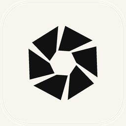
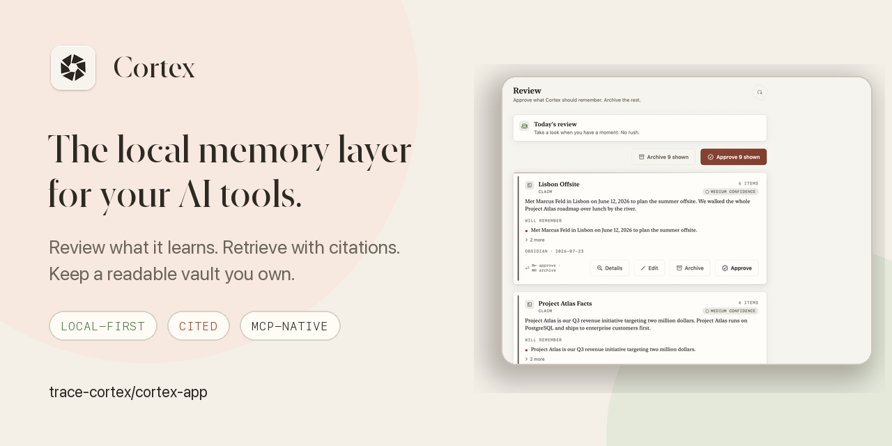
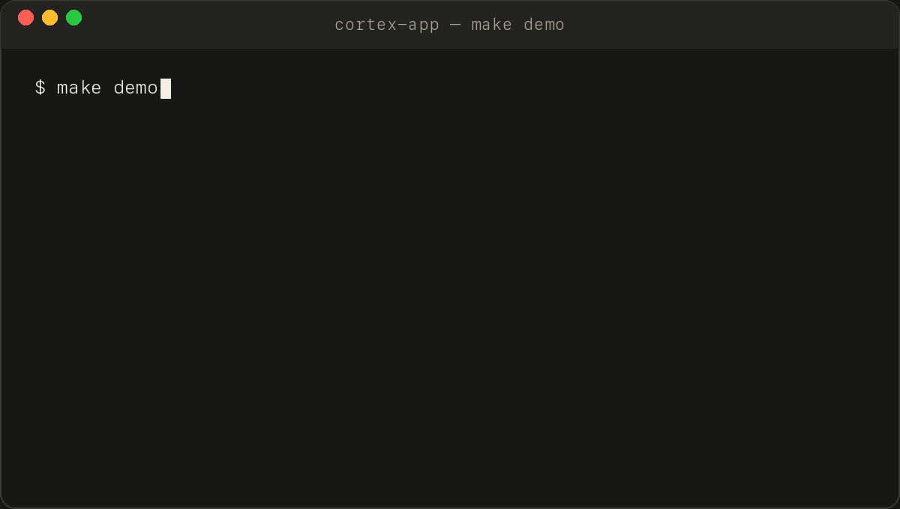
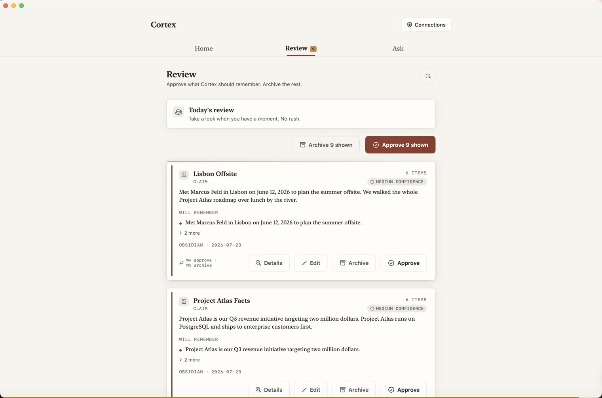
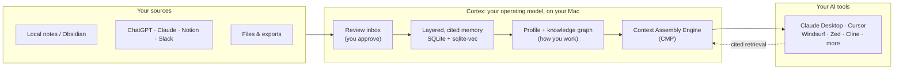

<div align="center">



# Cortex

### The local memory layer for the AI tools you already use.

**Review what it learns · Retrieve with citations · Keep a vault you own**

[](https://github.com/trace-cortex/cortex-app/actions/workflows/ci.yml)
[](https://github.com/doppl-tech/releases/releases/latest)
[](LICENSE)
[](.python-version)

<p>
  <a href="https://github.com/doppl-tech/releases/releases/latest"><b>Download for macOS</b></a>
  · <a href="#one-command-local-demo">One-command demo</a>
  · <a href="docs/README.md">Docs</a>
  · <a href="docs/ARCHITECTURE.md">Architecture</a>
  · <a href="ROADMAP.md">Roadmap</a>
</p>

</div>



Cortex gives Claude, Cursor, ChatGPT, and other AI tools one user-owned memory.
Bring in notes and chat history, approve what is worth remembering, then
retrieve only the context a task needs over MCP or HTTP. The local engine
returns source citations—or explicitly abstains when the evidence is not there.

> If local, portable AI memory is a problem you want solved, **star Cortex to
> follow the beta**. If something breaks, tell us—the project is built in the
> open and the rough edges are documented.

## Why Cortex exists

| Stop repeating yourself | Keep memory trustworthy | Switch tools freely | Inspect everything |
|---|---|---|---|
| Reuse approved project decisions, preferences, and context across sessions. | New memories wait in Review; edit, approve, or archive them. | Serve the same cited memory to MCP clients instead of rebuilding a profile in every app. | The vault stays readable as Markdown/JSON, with SQLite as a rebuildable index. |

## One-command local demo

The demo uses three synthetic Project Atlas records. The source workflow needs
Git, Make, and Python 3.12, but no API key, Docker, Redis, model provider, or
personal Cortex vault.

```bash
git clone https://github.com/trace-cortex/cortex-app.git
cd cortex-app
make demo
```

<p align="center">
  
</p>

`make demo` checks prerequisites, creates `.venv` when needed, runs an isolated
loopback server on a free port, prints a cited answer, then removes the
temporary vault. If Python 3.12 is not discoverable, `make doctor` prints the
exact fix for an existing interpreter. A fresh clone downloads the pinned
development dependencies and may take a few minutes; subsequent runs complete
in seconds.

<details>
<summary>See the exact expected output</summary>

```text
Cortex is working.
  [ok] isolated loopback server started
  [ok] 3 synthetic Project Atlas captures loaded
  [ok] Ask returned cited evidence

Question: When does Project Atlas ship?
Answer:   Cortex returned a cited answer for this question: …
Citation: https://example.invalid/cortex-demo/project-atlas
```

</details>

### Pick your path

| I want to… | Fastest path |
|---|---|
| Use Cortex | **[Download the signed and notarized macOS beta](https://github.com/doppl-tech/releases/releases/latest)** |
| Evaluate the engine safely | Run `make demo` with synthetic data |
| Build an agent integration | Use the [Python SDK](sdk/python/README.md), [TypeScript SDK](sdk/typescript/README.md), or [MCP guide](docs/MCP_INTEGRATIONS.md) |
| Contribute | Run `make doctor`, then open the [contributor guide](CONTRIBUTING.md) |
| Understand the internals | Read [Architecture](docs/ARCHITECTURE.md), [CMP](docs/CMP_PROTOCOL.md), and the [vault format](docs/LOCAL_VAULT_FORMAT.md) |

> [!NOTE]
> The desktop beta currently requires Apple Silicon, macOS 13+, and a one-time
> account sign-in. Backend development and the demo run on macOS or Linux.
> Read the [limitations](#current-limitations-plainly) before installing.

The source of truth is this `trace-cortex` repository. Signed installers are
published by the project maintainer in `doppl-tech/releases`; the committed
[release manifest](site/downloads/latest.json) records the build, source
commit, artifacts, and checksums.

## The product loop

| ① Connect | ② Review | ③ Ask | ④ Control |
|---|---|---|---|
| Bring in notes, chat exports, files, or a live source. | Approve what is useful; edit or archive the noise. | Get cited evidence in Cortex or retrieve it from an MCP client. | See and revoke every tool, scope, read, save, and export permission. |



<p align="center"><sub>Published macOS beta · Review screen · synthetic sample notes, not personal data</sub></p>

## A different default for AI memory

| Design choice | Cortex default | Why it matters |
|---|---|---|
| Storage | Local readable vault; rebuildable index | Your memory survives an app or model change |
| Admission | Explicit review for connected sources | Noisy inputs do not silently become personal facts |
| Retrieval | Cited evidence or abstention | Agents can preserve provenance instead of inventing confidence |
| Delivery | Bounded, model-calibrated context over MCP and HTTP | Tools receive task-relevant context, not a vault dump |
| Providers | On-device embeddings; deterministic Ask | The core loop does not need a model API key |

## Reproducible proof, not a leaderboard claim

The checked-in offline gates use synthetic fixtures with known answers and no
model API calls. The recorded source-checkout run passed 163 labeled
**hash/FTS retrieval** queries, 30 context-packing checks, and every no-leak and
budget check. It does not measure the bundled Model2Vec semantic path.

| Gate | Recorded result |
|---|---:|
| Deterministic hash/FTS retrieval top-1 / recall@3 | 1.000 / 1.000 |
| Packed-context citation coverage | 1.000 |
| Session delta token savings | 28.5% |
| Token-estimator MAPE vs simulated references | 1.58% |

These are deterministic regression results—not proof of real-world answer
quality or latency. Read the [method, machine-readable snapshot, commands, and
limitations](docs/BENCHMARKS.md), then reproduce them locally. CI also runs
2,000+ backend tests plus SDK, plugin, security, packaging, and documentation
gates.

## What you can build

| Starting point | Outcome |
|---|---|
| [`minimal_search.py`](examples/minimal_search.py) | Add cited local-memory search to a script in a few lines |
| [`memory_workflow.py`](examples/memory_workflow.py) | Search and Ask a factual query, then assemble bounded context for a work-shaped task |
| [`multi_agent_context.py`](examples/multi_agent_context.py) | Give planner, researcher, and writer agents different views of the same approved memory |
| [`tool_catalog.py`](examples/tool_catalog.py) | Expose Cortex through an OpenAI-compatible tool catalog without calling a model |
| [Connector guide](docs/ADDING_A_CONNECTOR.md) | Send records through the generic source contract or ship a first-party connector |

All examples are provider-neutral and run against the same local API. Start
with the [example guide and synthetic fixture](examples/README.md).

## What Cortex does today

Cortex is a **macOS beta**. It runs a local engine on your Mac that ingests your notes and AI-chat
exports, turns them into typed and cited memory you review, and serves that memory to AI tools over
MCP.

Concretely, today you can:

- **Bring in your history.** Drop in a ChatGPT, Claude, Gemini, Notion, Slack, Discord, or Telegram
  export — or mbox/eml, `.ics`, `.vcf`, DOCX, Zoom transcripts, browser bookmarks, an X or LinkedIn
  archive, and more. See [`docs/SOURCE_IMPORTS.md`](docs/SOURCE_IMPORTS.md).
- **Sync live sources with a key you paste.** GitHub (secretless device-flow sign-in), Slack, Linear,
  Jira, Readwise, Raindrop, Zotero, Calendar, Notion, and Obsidian.
- **Review before you remember.** Captures from connected sources land in a Review inbox, grouped into at
  most fifteen decisions, where you approve, edit, or archive. Approving records the memory and its audit
  event in SQLite, then mirrors it to your Markdown vault. Files you import yourself are treated as trusted
  and are usable right away; pass `auto_approve=false` to route them through Review too.
- **Ask and get citations or nothing.** Retrieval fuses BM25, `sqlite-vec` vector KNN, and temporal
  signals, reranks on-device, and passes through a cite-or-abstain gate. With no cited evidence it tells
  you so rather than guessing.
- **Connect your tools in one click.** Claude Desktop, Cursor, Windsurf, Zed, Cline, Roo Code, VS Code
  Copilot, and Claude Code get a Cortex MCP server written into their config.
- **Keep control.** Per-tool tokens are scoped and revocable, secret/email redaction is on by default,
  and export, maintenance, and destructive capabilities are **off** until you enable them.

Ask composes its answers deterministically from cited excerpts — no generative language model is
bundled or called to write prose. Retrieval embeddings run entirely on-device.

### Current limitations, plainly

- **Apple Silicon, macOS 13+.** The Swift target is `arm64-apple-macosx13.0`; there is no Intel or
  universal build.
- **This beta requires a one-time account sign-in.** The shipped build sets `CortexRequireAccount`, so
  first launch shows a sign-in wall. Your memory still lives and is queried locally — the account is
  identity plus an optional sync target. There is an "Explore with sample notes" path, but it is not
  remembered between launches.
- **Cloud sync is not end-to-end encrypted by default.** Client-side E2EE exists but is opt-in and off,
  so anything you sync is readable server-side. See [`docs/E2EE_SYNC_DESIGN.md`](docs/E2EE_SYNC_DESIGN.md).
- **Managed Google / Microsoft / Notion OAuth is implemented but not configured** in this build; those
  client IDs ship empty. Use file import or a pasted token instead.
- **PDF text extraction is inactive** in the shipped app — `pypdf` is not bundled.

## How it works



A native **SwiftUI** app bundles a Python 3.12 interpreter and launches a local engine
(`backend/app/standalone_server.py`, stdlib `http.server`) on `127.0.0.1:8766`, loopback only. Ingested
sources become typed memory in a **SQLite** store — FTS5 full-text plus `sqlite-vec` vectors — that
mirrors to a human-readable, Obsidian-style vault at
`~/Library/Application Support/Cortex/Cortex.vault/`. When a tool asks, the **Contextual Memory
Protocol** packs the smallest cited, model-calibrated context that answers the task.

The same storage core also runs behind a **FastAPI** app (`backend/app/main.py`) for the hosted
accounts and sync plane. That server is not part of the desktop app's local engine.

## Inside the operating model

Approved memory goes in; a calibrated model of how you operate comes out.

- **It packs context as a protocol.** The [Contextual Memory Protocol](docs/CMP_PROTOCOL.md) fits an
  **SMP envelope** calibrated to the consuming model: name your model and the pack is token-budgeted and
  filled by a marginal-utility knapsack with MMR diversity rather than a flat greedy fill. A
  **per-session delta channel** then tells each agent what changed since its last turn — new,
  superseded, evicted — and never re-announces a memory it already holds, an invariant pinned in CI by
  [`scripts/context_pack_eval.py`](scripts/context_pack_eval.py).
- **It retrieves and cites, or abstains.** BM25 and `sqlite-vec` vector KNN are fused with temporal
  signals by weighted reciprocal rank, diversified by provenance, and reranked on-device with MMR; an
  intent retriever backs them up when the lexical and temporal arms come back empty. Embeddings come
  from a bundled 256-dimension `model2vec` model — no API key, no network. When nothing carries a
  relevant citation, Ask returns that fact instead of an answer.
- **It models judgment.** Deterministic extractors build seven typed layers — `semantic`, `episodic`,
  `style`, `decision`, `preference`, `negative`, `procedural` — plus entity and topic indexes, into a
  whole-person map. Agents call `GET /v1/agent-adaptation` to load your calibration brief before they
  work.
- **It recalls relationally.** Ask expands along direct stored relations (shared entity, same capture).
  Agents can opt into **bounded multi-hop recall** over a trust-aware memory graph — depth ≤ 3,
  trust-floored, path-strength gated — including a true **personalized-PageRank** mode, via
  `search_memory` with `associative=true`. Every hop returns its full path with per-edge kind and weight.
  Neither is the default Ask path.
- **It consolidates on request.** A bounded consolidation pass resolves only contradictions that clear
  deterministic safety rules, keeps your source memory authoritative, logs every decision, and pre-warms
  verified hot-context packs. It runs when invoked (`POST /v1/memory/consolidate` or the
  `consolidate_memory` tool) and requires the maintenance permission, which is off by default.
- **It compounds as an asset you own.** Pin a pack and it becomes **sha256-addressed and replayable**,
  byte-verified on every read, so an agent can prove exactly what it acted on. Your model lives as plain
  Markdown memories plus durable JSON/JSONL records, with an index rebuildable from that vault — vendor-portable, inspectable, exportable as
  a signed bundle, and erasable in one act. Switch assistants and it comes with you.

## Also inside

- **One-click connections.** Config-write-and-relaunch for desktop MCP clients, deeplink install for
  Cursor and VS Code, and copy-paste HTTP endpoints for LM Studio, Open WebUI, LibreChat, and
  AnythingLLM. Web tools (ChatGPT, Claude web, Perplexity, Gemini) connect through a hosted connector
  key and need an account. See [`docs/EXTERNAL_INTEGRATIONS.md`](docs/EXTERNAL_INTEGRATIONS.md) and
  [`docs/MCP_INTEGRATIONS.md`](docs/MCP_INTEGRATIONS.md).
- **A curated MCP surface.** Tokens minted for your tools carry `read` and `write` scopes and see ten
  core tools, including `use_cortex`, `get_context`, `ask_memory`, `search_memory`, and `remember_this`.
  Permission checks run on every call, not just in the UI.
- **Trust controls.** Scoped revocable per-tool permissions, redaction on by default, an append-only
  audit log, and a tamper-evident hash chain over your history. See
  [`docs/TRUST_CONTROLS.md`](docs/TRUST_CONTROLS.md).
- **Portable memory.** A published, test-vectored bundle spec under
  [`spec/portable-memory/v2/`](spec/portable-memory/v2). See
  [`docs/PORTABLE_MEMORY_PROTOCOL_V2.md`](docs/PORTABLE_MEMORY_PROTOCOL_V2.md).

## Beyond the Mac app

| Surface | What it is | Path |
|---|---|---|
| Obsidian plugin | Sync a vault and write cited memory back into it | [`packages/obsidian-cortex-plugin`](packages/obsidian-cortex-plugin) |
| Browser extension | MV3 extension that injects cited context into ChatGPT, Claude, and Notion | [`extension/`](extension) |
| OpenClaw context plugin | Context-engine adapter for OpenClaw | [`packages/openclaw-cortex-context`](packages/openclaw-cortex-context) |
| Python SDK | Dependency-free client for the local API | [`sdk/python`](sdk/python) |
| TypeScript SDK | Dependency-free client for the local API | [`sdk/typescript`](sdk/typescript) |

## Install

1. **[Download the latest DMG →](https://github.com/doppl-tech/releases/releases/latest)** (macOS 13 or
   later, Apple Silicon).
2. Open the DMG and drag **Cortex** into Applications.
3. Launch it. Release builds are Developer ID signed and **notarized by Apple**, so it opens with no
   warning.
4. Sign in, then point Cortex at a notes folder or import your AI chats, review your first memories,
   and connect a tool.

Cortex checks the HTTPS release feed for new builds and links you to the current DMG. Installing an
update still uses the normal macOS app-replacement flow.

## Run a persistent development server

Use `make demo` first if you only want to evaluate the engine. It creates the
development environment, so you do not need to run setup again. If you skipped
the demo, run `make setup` once.

For API and SDK development, start the FastAPI development runtime locally:

```bash
CORTEX_AUTO_APPROVE_CAPTURES=1 make run
```

This is local development—not Cortex Cloud. It writes disposable development
state under `backend/data/Cortex.vault/` and does not read the installed app's
vault under `~/Library/Application Support/Cortex/`. Auto-approval is enabled
here so the synthetic examples are immediately searchable; normal product
sources remain review-first.

If the installed app or another process already owns port 8766, `make run`
prints a free-port command and the matching `CORTEX_BASE_URL` export.

In a second terminal:

```bash
curl -sS http://127.0.0.1:8766/v1/captures \
  -H 'Authorization: Bearer dev-local-key' \
  -H 'Content-Type: application/json' \
  -d '{"content":"Project Atlas ships Thursday after the rollback drill.","source":"quickstart"}'

curl -sS -G http://127.0.0.1:8766/v1/ask \
  -H 'Authorization: Bearer dev-local-key' \
  --data-urlencode 'query=When does Project Atlas ship?'
```

The second response either includes the cited quickstart memory or explicitly
abstains. Next, try the runnable [Python examples](examples/README.md), the
[Python SDK](sdk/python/README.md), or the
[TypeScript SDK](sdk/typescript/README.md). Interactive API documentation is at
`http://127.0.0.1:8766/docs`. `dev-local-key` is accepted only by the explicit
local development configuration.

## Build from source

Backend/API development requires **Git, Make, and Python 3.12**. Xcode command
line tools are required only to build the macOS app. CI and the packaged
runtime both use Python 3.12.

```bash
# Reproducible contributor environment
make setup
make check
make test

# macOS app (SwiftUI) — writes macos/build/Cortex.app
./macos/build.sh

# Run the local FastAPI development API at 127.0.0.1:8766
make run

# Or run the stdlib engine the packaged app actually ships
make run-standalone

# Deterministic, offline quality gates (use the pinned contributor environment)
.venv/bin/python scripts/retrieval_eval.py
.venv/bin/python scripts/adaptation_eval.py
```

By default `./macos/build.sh` produces an ad-hoc-signed app with **no** bundled interpreter or
embedding model, and prints an embeddings-fallback warning — good enough to launch and inspect. A full
build needs `CORTEX_BUNDLE_PYTHON=1` and a python.org framework install at
`/Library/Frameworks/Python.framework/Versions/3.12`, or set
`CORTEX_PYTHON_FRAMEWORK_SOURCE` to another complete Python 3.12 framework
(including Homebrew's framework). Release packaging lives in
`macos/package_release.sh`; CI boots and exercises the bundled interpreter,
native vector runtime, offline embedding model, capture path, and cited Ask.

CI runs the full gate set for pull requests and pushes to `main` — see [`.github/workflows/ci.yml`](.github/workflows/ci.yml)
for the authoritative command list. [`SETUP.md`](SETUP.md) covers the app-side development loop.

## Repository layout

| Path | What lives there |
|---|---|
| `macos/` | The SwiftUI/AppKit app and its build and packaging scripts |
| `backend/app/` | Storage core, retrieval, connectors, MCP tools, and both HTTP servers |
| `backend/tests/` | The test suite (2,000+ pytest cases, plus parameterized subtests) |
| `scripts/` | Dev helpers plus the deterministic CI quality gates |
| `packages/`, `sdk/`, `extension/` | Plugins, client SDKs, and the browser extension |
| `docs/` | Architecture, protocol, and release documentation |
| `deploy/`, `site/` | Hosted-plane ops and the static distribution site |
| `legacy/` | Archived Redis/Voyage/Streamlit prototype; not used by or installed with the current product |

Use the [contributor code map](docs/CODE_MAP.md) to find the first implementation
file and focused test for a change.

## Documentation

| Area | Doc |
|---|---|
| Documentation index and status | [`docs/README.md`](docs/README.md) |
| System architecture and contributor code map | [`docs/ARCHITECTURE.md`](docs/ARCHITECTURE.md) · [`docs/CODE_MAP.md`](docs/CODE_MAP.md) |
| Contextual Memory Protocol | [`docs/CMP_PROTOCOL.md`](docs/CMP_PROTOCOL.md) · [`docs/PORTABLE_MEMORY_PROTOCOL_V2.md`](docs/PORTABLE_MEMORY_PROTOCOL_V2.md) |
| The vault format you own | [`docs/LOCAL_VAULT_FORMAT.md`](docs/LOCAL_VAULT_FORMAT.md) |
| Connecting AI tools | [`docs/EXTERNAL_INTEGRATIONS.md`](docs/EXTERNAL_INTEGRATIONS.md) · [`docs/MCP_INTEGRATIONS.md`](docs/MCP_INTEGRATIONS.md) |
| Importing sources and adding connectors | [`docs/SOURCE_IMPORTS.md`](docs/SOURCE_IMPORTS.md) · [`docs/ADDING_A_CONNECTOR.md`](docs/ADDING_A_CONNECTOR.md) |
| Trust & privacy controls | [`docs/TRUST_CONTROLS.md`](docs/TRUST_CONTROLS.md) |
| Reproducible benchmark results | [`docs/BENCHMARKS.md`](docs/BENCHMARKS.md) |
| Open-source readiness review | [`docs/OPEN_SOURCE_READINESS.md`](docs/OPEN_SOURCE_READINESS.md) |
| Examples | [`examples/README.md`](examples/README.md) |
| FAQ and troubleshooting | [`docs/FAQ.md`](docs/FAQ.md) · [`docs/TROUBLESHOOTING.md`](docs/TROUBLESHOOTING.md) |
| Sync & encryption | [`docs/E2EE_SYNC_DESIGN.md`](docs/E2EE_SYNC_DESIGN.md) · [`docs/CXE1_WIRE_FORMAT.md`](docs/CXE1_WIRE_FORMAT.md) |
| Install & update checks | [`docs/INSTALLER_AND_UPDATES.md`](docs/INSTALLER_AND_UPDATES.md) |
| Release & distribution | [`docs/DISTRIBUTION.md`](docs/DISTRIBUTION.md) · [`docs/APPLE_RELEASE.md`](docs/APPLE_RELEASE.md) |
| Experimental pairwise twin evaluation | [Overview](https://github.com/trace-cortex/cortex-app/blob/feat/pairwise-twin-eval/docs/PAIRWISE_TWIN_EVALUATION.md) · [Integration guide](https://github.com/trace-cortex/cortex-app/blob/feat/pairwise-twin-eval/docs/PAIRWISE_TWIN_INTEGRATION_GUIDE.md) |

## Build with us

Cortex is an early open-source beta, and small, evidence-backed contributions
are welcome. You do not need a personal vault to help: the demo, examples, and
evaluation fixtures all use synthetic data.

| Bring… | Start here |
|---|---|
| A reproducible bug | [Open a bug report](https://github.com/trace-cortex/cortex-app/issues/new?template=bug_report.yml) |
| Installation friction | [Ask for setup help](https://github.com/trace-cortex/cortex-app/issues/new?template=installation_help.yml) |
| A focused product idea | [Propose a feature](https://github.com/trace-cortex/cortex-app/issues/new?template=feature_request.yml) |
| An integration you built | [Share it with the community](https://github.com/trace-cortex/cortex-app/issues/new?template=showcase.yml) |
| A code or docs contribution | Read [`CONTRIBUTING.md`](CONTRIBUTING.md) and run `make check` |

Please keep real memories, exports, tokens, and vaults out of issues. Report
vulnerabilities privately through [`SECURITY.md`](SECURITY.md). Project
direction, support boundaries, and releases live in
[`ROADMAP.md`](ROADMAP.md), [`SUPPORT.md`](SUPPORT.md), and
[`CHANGELOG.md`](CHANGELOG.md).

## Privacy

Your memory is stored as plain files on your Mac at
`~/Library/Application Support/Cortex/Cortex.vault/`, and ingestion, retrieval, Ask, and the profile all
run locally on the bundled engine — embeddings included. Cortex reads a source only after you connect
it and records nothing ambient: there is no microphone access, and screen capture happens only when you
trigger it. Context goes to an AI tool only within the scoped permission you grant, with redaction on by
default.

Two things worth being precise about. The current beta build requires a one-time account sign-in for
identity and sync, so it is not account-free — though your memory stays local either way. And synced
content is readable server-side unless you turn on client-side encryption, which is off by default.
Questions: **sdoven@uwaterloo.ca** or **vamika_singhal@berkeley.edu**.

## Affiliations & sponsor

<table>
  <tr>
    <td align="center" width="33%">
      <a href="https://uwaterloo.ca"></a><br/>
      <sub>Built at the <b>University of Waterloo</b><br/>Faculty of Engineering</sub>
    </td>
    <td align="center" width="33%">
      <a href="https://uwaterloo.ca/research"></a><br/>
      <sub>An applied <b>research</b> project on<br/>local-first personal operating models</sub>
    </td>
    <td align="center" width="33%">
      <a href="https://composio.dev"></a><br/>
      <sub>Proudly sponsored by<br/><a href="https://composio.dev"><b>Composio</b></a></sub>
    </td>
  </tr>
</table>

## License

Cortex is released under the **[MIT License](LICENSE)**, free to use, modify, and build on.
© 2026 Doppl.

<div align="center">
<br/>

**One memory you can inspect. Cited context your tools can use.**

<br/>

[⭐ Star Cortex](https://github.com/trace-cortex/cortex-app)
· [Download the beta](https://github.com/doppl-tech/releases/releases/latest)
· [Build an integration](examples/README.md)
</div>
