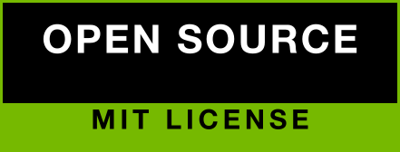
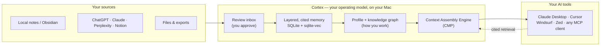

<div align="center">


# Cortex

### Your personal operating model for AI — private, on your Mac, owned by you.

Every AI tool you use runs on a generic model of the world. Cortex gives them a model of **you**.
It distills your notes and AI chat history into a living, **reviewed, cited operating model** — how
you work, what you've decided, how you write, what matters to you — and serves it to Claude, ChatGPT,
Cursor, and any MCP-capable tool. They stop starting from zero and start working the way you would.

<br/>

<!-- Affiliation, sponsor & license — individual buttons: each bordered, rounded, spaced -->
[](https://uwaterloo.ca)
[](https://uwaterloo.ca/engineering)
[](https://uwaterloo.ca/research)
[](https://composio.dev)
[](LICENSE)

<br/>

[](https://github.com/doppl-tech/releases/releases/latest)

<br/>


</div>

---

## Why Cortex

Every assistant forgets the work you already did. You re-explain your project, your preferences, your
decisions — every session, to every tool. The fix isn't a bigger context window; it's a **personal
operating model**: one place that learns how you work, holds it as reviewed, cited memory, and serves
it to every tool — without shipping your life to someone else's server.

- **Local-first, by default.** Your memory is plain files on your Mac at
  `~/Library/Application Support/Cortex/Cortex.vault/`. It works with the network off. No account needed.
- **Reviewed, cited memory.** Nothing is "remembered" until you approve it. Every answer cites the
  source it came from — no hallucinated recall.
- **Works where you already work.** One click wires Cortex into Claude Desktop, Cursor, Windsurf,
  Zed, and any MCP client. Bring your history in from ChatGPT, Claude, Perplexity, and Notion.
- **You hold the controls.** Per-tool permissions for read, save, export, and repair. Redaction on
  by default. Revoke anything, anytime.

## The loop

<div align="center">

| ① Connect | ② Review | ③ Ask | ④ Control |
|:--:|:--:|:--:|:--:|
| Bring in notes, an AI-chat export, or sign in and import your history | Approve what's useful, archive the noise — memory stays trustworthy | Ask with cited answers, or let a connected AI tool retrieve what you approved | Keep reads, saves, exports, and every connection visible and revocable |

</div>

## How it works



A native **SwiftUI** app bundles a local **FastAPI** engine on `127.0.0.1:8766`. Ingested sources become
typed, layered memory in a **SQLite** store (full-text + `sqlite-vec` vectors) that mirrors to a
human-readable, Obsidian-style vault you own. When a tool asks, the **Contextual Memory Protocol** packs
the smallest cited, model-calibrated context that answers the task.

## Your operating model

Memory is the foundation; the operating model is what Cortex builds on top of it. From your approved
memory, Cortex continuously distills a **cited model of how you work** — and exposes it to your tools:

- **Voice & style** — how you actually write, so drafts come out sounding like you.
- **Your preferences** — the tools, formats, and ways of working you've settled on.
- **Key decisions** — what you decided and why, so nothing gets relitigated from scratch.
- **Your world** — a knowledge graph of the people, projects, and topics around you, with the
  relationships between them.
- **Agent adaptation** — a machine-readable brief any connected agent can load to calibrate itself
  to you before it does the work.

Every claim in the model traces back to a memory you approved — it's *your* operating model, evidenced,
inspectable, and revocable, not a black-box profile someone else trained on you.

## What's inside

- **Contextual Memory Protocol (CMP)** — model-aware context packing (SMP envelope + per-session working
  set) that gives an agent exactly what it needs, cited, and nothing it doesn't. See [`docs/CMP_PROTOCOL.md`](docs/CMP_PROTOCOL.md).
- **A vault you own** — plain Markdown + a rebuildable index, portable like an Obsidian vault. See
  [`docs/LOCAL_VAULT_FORMAT.md`](docs/LOCAL_VAULT_FORMAT.md).
- **Retrieval that cites or abstains** — hybrid BM25 + vector + temporal ranking, reranking, and a
  cite-or-abstain gate so answers are grounded, never guessed.
- **One-click connections** — write-and-relaunch MCP config for desktop tools, session-import for the
  web chat apps, drag-and-drop for exports. See [`docs/MCP_INTEGRATIONS.md`](docs/MCP_INTEGRATIONS.md).
- **Trust controls** — scoped, revocable per-tool permissions with redaction. See [`docs/TRUST_CONTROLS.md`](docs/TRUST_CONTROLS.md).
- **Optional cloud sync** — an end-to-end-encryption design for multi-device sync, opt-in and
  account-based. Data stays local unless you turn it on. See [`docs/ACCOUNTS_ENCRYPTION_DESIGN.md`](docs/ACCOUNTS_ENCRYPTION_DESIGN.md).

## Install

1. **[Download the latest DMG →](https://github.com/doppl-tech/releases/releases/latest)** (macOS 13 or later).
2. Open the DMG and drag **Cortex** into Applications.
3. Launch it. It's Developer ID signed and **notarized by Apple**, so it opens with no warning.
4. Point Cortex at a notes folder or import your AI chats, review your first memories, then connect a tool.

Cortex checks for updates on its own, so once you're on a recent build, new releases arrive automatically.

## Build from source

```bash
# macOS app (SwiftUI)
./macos/build.sh

# Backend engine + test suite (Python 3.11+)
python3 -m venv .venv && source .venv/bin/activate
pip install -r backend/runtime-requirements.txt
python3 -m pytest backend/tests

# Retrieval-quality gate (deterministic, offline)
python3 scripts/retrieval_eval.py
```

See [`SETUP.md`](SETUP.md) for the full development setup and [`docs/ARCHITECTURE.md`](docs/ARCHITECTURE.md)
for how the pieces fit together.

## Documentation

| Area | Doc |
|---|---|
| System architecture | [`docs/ARCHITECTURE.md`](docs/ARCHITECTURE.md) |
| Contextual Memory Protocol | [`docs/CMP_PROTOCOL.md`](docs/CMP_PROTOCOL.md) · [`docs/PORTABLE_MEMORY_PROTOCOL_V2.md`](docs/PORTABLE_MEMORY_PROTOCOL_V2.md) |
| The vault format you own | [`docs/LOCAL_VAULT_FORMAT.md`](docs/LOCAL_VAULT_FORMAT.md) |
| Connecting AI tools (MCP) | [`docs/MCP_INTEGRATIONS.md`](docs/MCP_INTEGRATIONS.md) |
| Importing your sources | [`docs/SOURCE_IMPORTS.md`](docs/SOURCE_IMPORTS.md) |
| Trust & privacy controls | [`docs/TRUST_CONTROLS.md`](docs/TRUST_CONTROLS.md) |
| Encryption & sync design | [`docs/ACCOUNTS_ENCRYPTION_DESIGN.md`](docs/ACCOUNTS_ENCRYPTION_DESIGN.md) · [`docs/CXE1_WIRE_FORMAT.md`](docs/CXE1_WIRE_FORMAT.md) |
| Install & auto-updates | [`docs/INSTALLER_AND_UPDATES.md`](docs/INSTALLER_AND_UPDATES.md) |

## Privacy

Cortex is local-first: the default experience needs no account and no cloud. Cortex reads a source only
after you connect it, records nothing ambient (no screen, no microphone), and shares context with an AI
tool only within the scoped permission you grant. The optional Cortex Cloud tier (for multi-device sync)
is described honestly in the app and on the site. Questions: **sdoven@uwaterloo.ca** or **vamika_singhal@berkeley.edu**.

## Affiliations & sponsor

<table>
  <tr>
    <td align="center" width="33%">
      <a href="https://uwaterloo.ca"></a><br/>
      <sub>Built at the <b>University of Waterloo</b><br/>Faculty of Engineering</sub>
    </td>
    <td align="center" width="33%">
      <a href="https://uwaterloo.ca/research"></a><br/>
      <sub>An applied <b>research</b> project on<br/>local-first personal operating models</sub>
    </td>
    <td align="center" width="33%">
      <a href="https://composio.dev"></a><br/>
      <sub>Proudly sponsored by<br/><a href="https://composio.dev"><b>Composio</b></a></sub>
    </td>
  </tr>
</table>

## License

Cortex is released under the **[MIT License](LICENSE)** — free to use, modify, and build on.
© 2026 Doppl.

<div align="center">
<br/>

**Cortex is not just AI memory. It is your personal operating model for AI tools.**

<sub>It starts local and simple. The long-term product is the memory and action layer that helps
AI tools make progress the way you would — without giving up your privacy.</sub>
</div>
