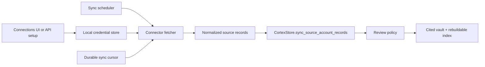

# Adding a Cortex Connector

This guide separates two different jobs:

1. **Send records from an existing integration.** Use the generic source-account
   API. You do not need to modify Cortex.
2. **Ship a first-party connector.** Add a source fetcher, credentials/setup
   metadata, scheduled sync, API parity, UI wiring, and contract tests.

Start with the generic API unless the integration must be configured and
scheduled by Cortex itself.

## Send One Cited Record Without Changing Cortex

Start the development server:

```bash
CORTEX_AUTO_APPROVE_CAPTURES=0 make run
```

In another terminal, run this complete review-first workflow:

```bash
export CORTEX_BASE_URL="${CORTEX_BASE_URL:-http://127.0.0.1:8766}"
export CORTEX_API_KEY=dev-local-key

ACCOUNT_JSON="$(
  curl --fail --silent --show-error \
    -H "Authorization: Bearer $CORTEX_API_KEY" \
    -H "Content-Type: application/json" \
    -d '{
      "source": "custom-notes",
      "account_label": "Connector tutorial",
      "account_identifier": "tutorial@example.invalid",
      "connection_type": "api",
      "status": "connected",
      "auth_state": "healthy",
      "policy": {"review_required": true, "allow_ai_context": true}
    }' \
    "$CORTEX_BASE_URL/v1/source-accounts"
)"
ACCOUNT_ID="$(
  printf '%s' "$ACCOUNT_JSON" |
    .venv/bin/python -c 'import json,sys; print(json.load(sys.stdin)["id"])'
)"

SYNC_JSON="$(
  curl --fail --silent --show-error \
    -H "Authorization: Bearer $CORTEX_API_KEY" \
    -H "Content-Type: application/json" \
    -d '{
      "records": [{
        "external_id": "tutorial-record-1",
        "title": "Project Firefly launch",
        "content": "Project Firefly launches on 15 August. Mina Chen is the DRI.",
        "source_url": "https://example.invalid/tutorial/project-firefly",
        "captured_at": "2026-07-30T12:00:00Z",
        "metadata": {"kind": "project-note"}
      }],
      "processing": "sync",
      "cursor_value": "tutorial-record-1"
    }' \
    "$CORTEX_BASE_URL/v1/source-accounts/$ACCOUNT_ID/sync"
)"
CAPTURE_ID="$(
  printf '%s' "$SYNC_JSON" |
    .venv/bin/python -c 'import json,sys; print(json.load(sys.stdin)["capture_ids"][0])'
)"

# Review-first invariant: the pending record must not be retrievable.
curl --fail --silent --show-error --get \
  -H "Authorization: Bearer $CORTEX_API_KEY" \
  --data-urlencode "query=Who is the DRI for Project Firefly?" \
  --data-urlencode "limit=5" \
  "$CORTEX_BASE_URL/v1/search" |
  .venv/bin/python -c '
import json, sys
base = "https://example.invalid/tutorial/project-firefly"
results = json.load(sys.stdin).get("results", [])
assert all(not str(item.get("source_url", "")).startswith(base) for item in results)
print("pending capture is correctly excluded from retrieval")
'

curl --fail --silent --show-error -X POST \
  -H "Authorization: Bearer $CORTEX_API_KEY" \
  "$CORTEX_BASE_URL/v1/captures/$CAPTURE_ID/approve" >/dev/null

curl --fail --silent --show-error --get \
  -H "Authorization: Bearer $CORTEX_API_KEY" \
  --data-urlencode "query=Who is the DRI for Project Firefly?" \
  --data-urlencode "limit=5" \
  "$CORTEX_BASE_URL/v1/ask" |
  .venv/bin/python -m json.tool
```

The cited answer should include the original `source_url` as its base. Cortex
may append a generated `#line=...&excerpt=...` locator so clients can open the
specific cited passage. Keep `external_id` stable: re-sending the same source
record updates its capture instead of duplicating it.

## The Normalized Record Contract

A connector converts vendor data into at most 500 records per sync request:

| Field | Required | Rule |
|---|---:|---|
| `content` | yes | Plain, useful source text; maximum 200,000 characters |
| `external_id` | strongly recommended | Stable and unique within the source account |
| `title` | no | Human-readable source title |
| `source_url` | no | Original deep link; Cortex creates a stable locator if absent |
| `captured_at` | no | Source timestamp in ISO 8601 form |
| `metadata` | no | Non-secret filtering and provenance fields |

Never put access tokens, session cookies, authorization headers, or refresh
tokens in record content, metadata, errors, logs, or fixtures.

## First-Party Connector Architecture

Use [`backend/app/connectors/raindrop.py`](../backend/app/connectors/raindrop.py)
as the smallest token-based reference and
[`backend/app/connectors/google_drive.py`](../backend/app/connectors/google_drive.py)
as an OAuth/pagination reference.



The fetcher is separate from persistence. It accepts credentials and cursor
state, performs bounded read-only requests, and returns normalized records plus
the next cursor. `CortexStore` owns deduplication, review policy, extraction,
provenance, and vault writes.

## Implementation Checklist

### 1. Fetch and normalize

- Add `backend/app/connectors/<source>.py`.
- Return immutable record and sync-result dataclasses with a
  `to_source_account_record()` adapter.
- Bound page size, pages per sync, total records, response size, and request
  timeouts.
- Preserve a stable vendor record ID, original deep link, and source timestamp.
- Make pagination resumable. Do not advance the durable high-water mark until a
  bounded scan completes.
- Use `backend/app/http_security.py` for outbound requests and enforce the
  official HTTPS origin. Redirects must not escape the allowed origin.
- Redact credentials and authorization headers from every error with
  `backend/app/connectors/_redaction.py`.

### 2. Register the connector

- Export the fetcher and record types from
  `backend/app/connectors/__init__.py`.
- Add setup/auth/readiness metadata to `CONNECTOR_SETUP_BLUEPRINTS` in
  `backend/app/storage.py`.
- Add or update the public connector catalog entry used by
  `source_connector_catalog()`.
- Add a `CortexStore` sync method that reads credentials, calls the fetcher,
  passes records to `sync_source_account_records()`, and persists cursor/error
  state.
- Register scheduled dispatch in the source-sync scheduler. A manual sync and a
  scheduled sync must call the same storage method.

### 3. Preserve both HTTP runtimes

- Add request/response fields to `backend/app/models.py` when the generic
  contract is insufficient.
- Add FastAPI routes in `backend/app/main.py`.
- Add matching behavior in `backend/app/standalone_server.py`. The standalone
  server is the runtime shipped in the macOS app; FastAPI-only support is
  incomplete.
- Add an MCP tool in `backend/app/mcp_tools.py` only if an AI client needs the
  operation. Give it the narrowest capability (`read`, `write`, or
  `maintenance`).

### 4. Add the product setup path

- Add the connector to the macOS Connections & Privacy catalog and setup flow.
- Store secrets only through the existing credential/Keychain boundary.
- Show required scopes before authorization, support disconnect/resume, and
  surface a redacted `last_error`.
- Keep file/export import as the fallback path when live authorization is not
  release-ready.

### 5. Prove the contract

At minimum, tests must cover:

- empty/malformed/oversized vendor responses;
- pagination, cursor replay, and an interrupted scan;
- stable IDs, unchanged-record deduplication, and changed-record replacement;
- duplicate text with different external IDs;
- citation/deep-link preservation;
- credential and error redaction;
- origin/redirect enforcement;
- disconnect, resume, and scheduled sync;
- FastAPI and standalone-server parity;
- connector catalog and macOS UI visibility.

Use deterministic fixtures and injected request functions. Tests must not call
the real vendor service.

```bash
.venv/bin/python -m pytest backend/tests/test_<source>_connector.py -q
.venv/bin/python scripts/check_connector_baseline.py
.venv/bin/python scripts/examples_smoke.py --quickstart --runtime standalone
make check
```

## Definition of Done

A connector is ready only when a new user can discover it, understand its
scopes, connect or disconnect it, complete an incremental sync, review the
result, and retrieve a source-bearing citation. The same workflow must pass in
the packaged standalone runtime and the FastAPI development runtime.

If any of those pieces is intentionally absent, label the connector as
experimental or export-only in the catalog instead of presenting it as ready.
