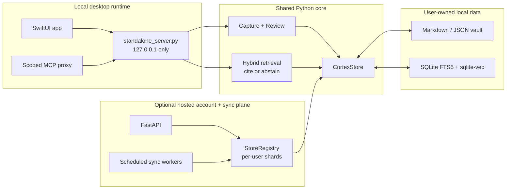
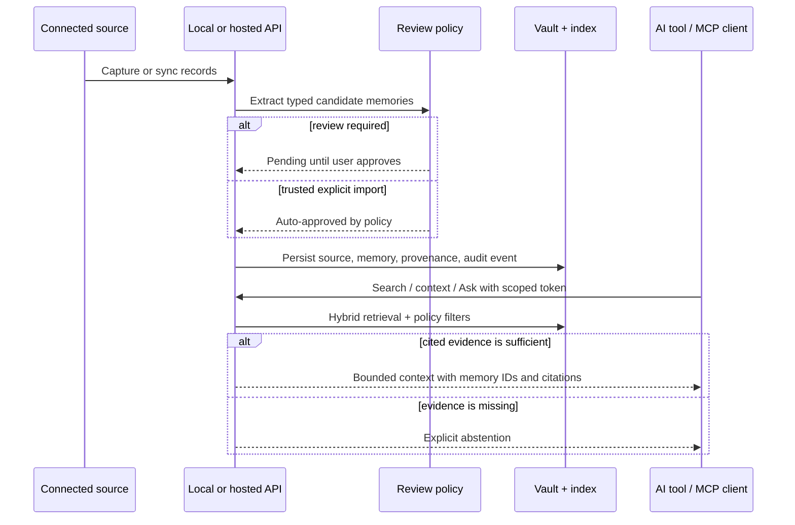

# Cortex Architecture

## Runtime Boundaries

Cortex has two runtimes around one storage and retrieval core. The packaged
macOS app starts a loopback-only standard-library server. The optional hosted
plane uses FastAPI, account authentication, and per-user sharded stores.



The desktop app and hosted plane are separate trust boundaries. A path supplied
to the hosted API names a file on the server—not on the user's Mac—so
filesystem connectors and path-based imports are local-only. Credential-bearing
hosted connectors are restricted to their official service origins.

## Legacy Prototype (Reference Only)

The original prototype has these pieces:

- `legacy/capture.py`: macOS menu bar capture using Python
- `legacy/ingest.py`: Claude-based extraction into records, tasks, and entities
- `legacy/github_store.py`: markdown persistence in GitHub
- `legacy/redis_store.py`: Voyage embeddings plus Redis vector search
- `legacy/mcp_server.py`: legacy prototype local stdio MCP server; packaged builds use the app-bundled `scripts/cortex_mcp_stdio.py` proxy instead
- `legacy/ui.py`: Streamlit memory chat

These modules are isolated under `legacy/`, retained for reference, and not
used by the packaged app. New product work belongs in `backend/app/`, `macos/`,
the SDKs, or the integration packages.

## Current Product

The current product adds a backend service and native macOS client while
preserving the extraction schema.

```
macOS app
  Home
  Review
  Ask
  Connections & Privacy
  MCP AI-tool setup via /Applications/Cortex.app/Contents/Resources/scripts/cortex_mcp_stdio.py
  Obsidian/local notes sync
      |
      v
Shared API surface
  FastAPI: development and optional hosted plane
  standalone_server.py: packaged local subset
  /v1/captures
  /v1/captures/queue
  /v1/captures/{id}/status
  /v1/imports/sources
  /v1/imports/analyze
  /v1/imports
  /v1/imports/{id}
  DELETE /v1/imports/{id}
  /v1/source-accounts/catalog
  /v1/sources/readiness
  /v1/source-accounts
  /v1/source-accounts/{id}/sync
  POST /v1/sources/sync-due
  /v1/sync-cursors
  /v1/sync/devices
  /v1/sync/devices/{id}/receipts
  /v1/sync/changes
  /v1/jobs
  /v1/maintenance/jobs/run
  /v1/inbox
  /v1/captures/{id}/approve
  /v1/captures/{id}/archive
  DELETE /v1/captures/{id}
  DELETE /v1/memories/{id}
  /v1/search
  /v1/ask
  /v1/recent
  /v1/review/today
  /v1/loop
  /v1/loop/reuse
  /v1/context-pack
  /v1/personal-profile
  /v1/agent-adaptation
  /v1/graph
  /v1/stats
  /v1/settings
  /v1/trust/summary
  /v1/privacy/lifecycle
  /v1/audit-log
  /v1/diagnostics
  /v1/reliability/report
  /v1/support/bundle
  /v1/backups
  /v1/backups/restore-latest
  DELETE /v1/backups
  DELETE /v1/user-data
  /v1/maintenance/repair-storage
  /v1/maintenance/rebuild-search
  /v1/maintenance/rebuild-index-from-vault
  /v1/export.md
  /v1/export.json
  /mcp
      |
      v
Local vault
  manifest.json
  settings.json
  events.jsonl
  imports/*.json
  source_accounts/*.json
  sync_cursors/*.json
  captures/*.json
  memories/*.json
  tasks/*.json
  entities/*.json
  graph_edges/*.json
  backups/*.zip
      |
      v
Rebuildable SQLite index
  FTS5
  sqlite-vec when available
  bundled Model2Vec embeddings when available
  deterministic hash fallback or opt-in OpenAI embeddings
  normalized joins

Release pipeline
  macos/package_release.sh
  Cortex-<version>-<build>.dmg
  Cortex-<version>-<build>.app.zip
  latest.json update feed
  SHA-256 checksums
  site/
    landing page
    privacy page
    downloads/latest.json
    downloadable release artifacts
```

## Request Lifecycle



## Hosted Backend and Scale Path

The current hosted beta uses the same `CortexStore` behind `StoreRegistry`,
which assigns isolated SQLite/vault shards per user. Postgres/pgvector is a
future scale target, not the current hosted implementation.

| Local desktop | Current hosted beta | Future scale target |
|---|---|---|
| User-owned vault + SQLite index | Per-user vault/SQLite shards | Relational memory store + durable object storage |
| FTS5 + sqlite-vec | FTS5 + sqlite-vec per shard | Postgres full-text + pgvector, if benchmarks justify it |
| Loopback server + local MCP | FastAPI HTTPS + scoped account tokens | Same public contracts behind horizontally scaled services |
| Local review state | User-isolated hosted review state | Durable queues and multi-region operations |

Local mode remains vault/SQLite-first. The migration seam is the store registry
and public API contract; a future database change should not alter connector,
review, citation, or client behavior.

See `docs/MEMORY_BACKEND_BLUEPRINT.md` for the layered memory model and scale path across SQLite, sqlite-vec, libSQL/Turso, Postgres/pgvector, Qdrant, and LanceDB.

See `docs/INSTALLER_AND_UPDATES.md` for the local beta installer and update-manifest pipeline.

See `docs/DISTRIBUTION.md` for the landing page, static download directory, privacy copy, and release-site QA checklist.

See `docs/RELIABILITY_HARDENING.md` for the backend health contract, repair flow, and packaged-app reliability checks.

See `docs/SIMPLE_PRODUCT_LOOP.md` for the activation and retention loop: connect, review, ask, and reuse approved memory.

See `docs/OPERATIONAL_READINESS.md` for support bundles, ship gates, incident playbooks, rollback flow, and local-beta support operations.

## Memory Model

### Capture

A raw piece of context from clipboard, quick note, browser extension, AI chat, meeting transcript, or import.

Lifecycle:

- `pending`: captured and extracted, awaiting user review
- `approved`: accepted as trusted context
- `archived`: removed from active memory and search
- `deleted`: permanently removed from the current SQLite index and current vault JSON records; previous backup ZIPs still require retention pruning

### Fallback Import Session

A user-confirmed fallback batch created from selected local files, folders, or exports. It supports unsupported services, migration, tests, and support recovery. The primary MVP source path is MCP/Obsidian source-account sync, not manual import.

Lifecycle:

- `running`: records are being queued or saved
- `complete`: all detected records were queued or saved
- `partial`: one or more records failed
- `empty`: no records were detected
- `deleted`: the batch was undone by deleting linked captures and derived records

### Memory

An atomic extracted item:

- claim
- decision
- event
- preference
- style
- negative
- observation
- action
- question
- summary

Each memory also has a retrieval layer:

- semantic
- episodic
- style
- decision
- preference
- negative
- procedural

### Entity

A stable node in the user's life/work graph:

- person
- project
- org
- topic

### Edge

A relationship between captures, memories, tasks, and entities. This creates the node map that later powers visual graph exploration and richer retrieval.

### Trust

User-controlled policy for how memory can be shared and changed:

- review new captures before trust
- hide pending captures from AI context
- allow or block MCP agent reads
- allow or block MCP agent writes
- allow or block MCP agent exports
- redact sensitive patterns in context packs, exports, and agent payloads

Import preview is read-only and writes no capture, job, or import-session records. Import delete removes the selected batch from active vault/index state and records an import tombstone so old backups cannot silently restore it.

### Event

An audit record for user-visible lifecycle actions such as capture creation, approval, memory archive/delete, source archive/delete, settings changes, backups, and MCP tool calls.

### Product Loop

The simple product loop is backend-owned so the app and MCP agents agree on the same next step. `GET /v1/loop` returns connection, review, memory-use, and return state, and `POST /v1/loop/reuse` records when approved memory is used through Ask, a fallback context handoff, or an AI session.

### Sync Change Feed

`GET /v1/sync/devices`, `POST /v1/sync/devices`, and `DELETE /v1/sync/devices/{device_id}` maintain local device manifests in the vault and SQLite index. Device registration can generate a one-time local key; stored/listed records expose only a fingerprint plus health cursors and revocation state. `GET/POST /v1/sync/devices/{device_id}/receipts` stores content-free manifest acknowledgements so future materializers can distinguish served cursors from accepted, uploaded, or failed cursors.

`GET /v1/sync/changes` exposes the current user's audit-style memory events as a cursorable, content-free feed. The response includes event IDs, event/object types, safe internal object IDs or redacted hashes, whitelisted metadata, per-user counts, optional device metadata when `device_id` is supplied, the active shard assignment when available, and a high watermark. When `CORTEX_SYNC_SIGNING_KEY` is configured, device-bound responses include an HMAC-SHA256 signature over the returned manifest. It intentionally excludes capture content, memory text, imports, context packs, vault files, and support-only payloads.

This is the local primitive for future hosted materialization from append-only events. It does not yet implement hosted device authentication, asymmetric signing, device conflict resolution, remote object storage, OAuth live sync, encrypted cloud backups, or multi-device merge semantics.

## Local Vault

The local vault is the durable user-owned storage layer. SQLite is the fast local index.

Default packaged app path:

```text
~/Library/Application Support/Cortex/Cortex.vault/
```

The vault contains human-readable JSON records for imports, source accounts,
sync cursors, captures, memories, tasks, entities, and graph edges. Memories
also have editable Markdown notes; rebuild merges Markdown memories with the
other durable JSON/JSONL records under the precedence rules in
`LOCAL_VAULT_FORMAT.md`. SQLite is a rebuildable index, not the sole authority.

`POST /v1/maintenance/rebuild-index-from-vault` clears the current user's index
rows and rebuilds them from that merged durable representation.

See `docs/LOCAL_VAULT_FORMAT.md`.

### Maintenance

Local production builds expose diagnostics, backups, and search-index rebuilds. These are intentionally backend-owned because ChatGPT, Claude, the macOS app, and future browser extensions should all trust the same storage health surface.

The backend health contract proves the macOS app is talking to the expected local backend build and vault. Reliability reports combine SQLite integrity, vault layout, backup recency, search-index health, relationship health, sqlite-vec availability, and embedding-provider status. The repair endpoint creates a backup first, then cleans stale derived index rows and rebuilds search from canonical records.

Operational readiness adds a sanitized support bundle that omits captured text, memory bodies, context packs, and exported user data while preserving health checks, counts, feature flags, backup state, and safe event metadata.

## MCP Tools

The backend exposes an MCP-style JSON-RPC endpoint at `POST /mcp`. The tool registry is
`TOOLS` in `backend/app/mcp_tools.py` and is the source of truth — it currently holds 110
tools, so this document deliberately does not mirror the full list (a hand-copied list here
drifted to 42 stale entries before).

Clients cap how many tools they will accept (Cursor 40, ChatGPT 128), so tools are advertised
by *surface* — `MCP_TOOL_SURFACES` in the same module, with presets `core`, `coding`,
`chatgpt`, and `full`. The surface rides on the token's label. It is advertisement only and
never authorization: scopes (`read`, `write`, `export`, `maintenance`, `destructive`) plus the
user's Trust policy decide what a call is allowed to do, whatever the surface advertises.

The `core` surface is the default ten:

- `use_cortex`
- `get_context`
- `ask_memory`
- `query_memory`
- `expand`
- `search_memory`
- `get_entity_context`
- `get_person_map`
- `remember_this`
- `list_capabilities`

Beyond core, the registry groups roughly into: review/write (`propose_memory`,
`approve_memory_capture`, `archive_memory_capture`, `forget_memory`), profile and adaptation
(`get_personal_profile`, `get_agent_adaptation`, `get_style_profile`, `get_project_context`),
connectors (`list_source_connectors`, `connect_source_account`, `sync_connected_sources` plus
one `sync_*` per connector), sessions and context packs (`start_agent_session`,
`build_context_pack`, `verify_context_pack`), provenance and audit (`get_decision_history`,
`get_belief_timeline`, `verify_belief_proof`, `get_audit_log`, `get_trust_summary`), shared
memory, and portability (`export_memory_bundle`, `verify_memory_bundle`,
`create_memory_backup`).

Two tools are named `search` and `fetch` purely because the ChatGPT deep-research connector
requires those exact names; they are kept out of `core` so the default Claude/Cursor surface
is unchanged.

Desktop clients do not speak to `/mcp` directly. They launch the bundled stdio proxy
`scripts/cortex_mcp_stdio.py`, which pipes stdio JSON-RPC to `http://127.0.0.1:8766/mcp` with
a `cxm_` bearer token. Root `mcp_server.py` is the legacy prototype and is not used by
packaged builds.

The local source-account sync endpoint is enough for beta local app integrations, MCP bridges, and connector processes. Production ChatGPT/Claude and cloud-service connectors should add full remote MCP/OAuth flows on top of the same account, cursor, citation, and review contracts.

## Privacy Model

- No background app crawling in the MVP
- User-approved MCP and Obsidian sync only
- Source retained on every memory
- Review inbox for new captures
- Archive endpoint for full captures, hard-delete endpoints for individual memories/full captures/backups/all local user data, and latest-backup restore
- Export to markdown and JSON
- Local diagnostics and backups
- Sanitized support bundle for operational triage
- Future: sensitive source blocklist, hosted account deletion, per-source retention rules
