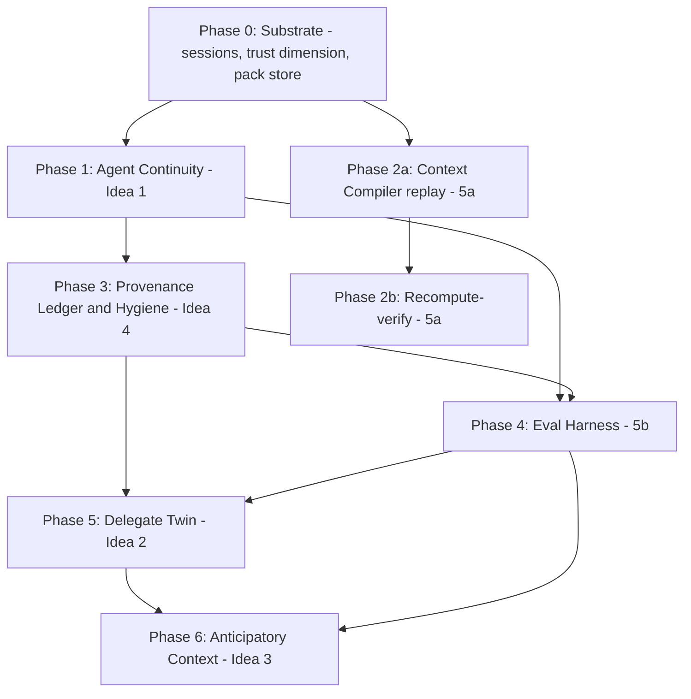

I've confirmed the schema/migration pattern (in-place `ALTER TABLE` guards like `storage.py:2864`, `memory_jobs` queue with typed jobs at `storage.py:17038`, worker tick in `worker.py:69`, and a large `backend/tests/` pytest suite). Here is the full technical roadmap.

# Cortex Expansion Roadmap: Ideas 1, 2, 3, 4, 5a, 5b

## Dependency graph and sequencing

The ideas are not independent. The build order below is forced by data dependencies, not preference:



Rationale: continuity (1) creates agent write-back, which makes hygiene (4) mandatory before the volume grows. The eval harness (5b) needs both agent output write-back (from 1) and trust scoring (from 4). The twin (2) needs the eval harness to measure itself. Anticipation (3) is last because its predictor trains on usage signals the earlier phases generate.

---

## Phase 0: Shared substrate (one sprint)

Everything else hangs off three primitives that don't exist yet.

### 0.1 Agent sessions table

New table, following the `memory_jobs` DDL pattern (`storage.py:16936`):

```sql
CREATE TABLE IF NOT EXISTS agent_sessions (
  id TEXT PRIMARY KEY,            -- 'asn_' + hex, via _new_id pattern (authn.py:103)
  user_id TEXT NOT NULL,
  token_id TEXT,                  -- which host token opened it (record_agent_event already has this, storage.py:16902)
  host_label TEXT,                -- 'Claude Desktop', 'Cursor' — from token label
  status TEXT NOT NULL DEFAULT 'active',  -- active | handed_off | closed | expired
  goal TEXT,                      -- agent-declared task
  parent_session_id TEXT,         -- handoff chain
  started_at TEXT NOT NULL,
  last_checkpoint_at TEXT,
  closed_at TEXT
);
```

Migration style: `CREATE TABLE IF NOT EXISTS` at schema init plus an `_ensure_*` guard, exactly like `_ensure_memory_occurrences_column` (`storage.py:2864`). No `PRAGMA user_version` bump needed; the codebase uses idempotent guards.

### 0.2 Authorship/trust columns on memories

Two `ALTER TABLE` guards:

```sql
ALTER TABLE memories ADD COLUMN author_class TEXT NOT NULL DEFAULT 'unknown';
  -- 'user' | 'agent' | 'connector' | 'unknown'
ALTER TABLE memories ADD COLUMN trust_score REAL NOT NULL DEFAULT 0.5;
```

Backfill deterministically from existing data: `self_authored` captures and `remember_this` → `user`; `source_account_id IS NOT NULL` → `connector`; extraction from sources labeled claude/chatgpt with assistant roles → `agent`. The authorship gate in `extractor.py:214-217` and `provenance_json` already carry the signal; this just materializes it as a queryable column. Mirror it into the vault Markdown frontmatter via `render_memory_markdown` (`vault_markdown.py`) and `_memory_edit_signature` (`storage.py:15731`) so reconcile round-trips it.

### 0.3 Context pack store

New vault directory `context_packs/` (add to `VAULT_DIRECTORIES`, `vault.py:54`, and deliberately NOT to `RESTORE_DIRECTORIES` reconcile globs, same reasoning as `ENTITY_MOC_DIRECTORIES` at `vault.py:71-75`), plus an index table:

```sql
CREATE TABLE IF NOT EXISTS context_packs (
  pack_sha TEXT PRIMARY KEY,      -- sha256 of canonical pack bytes
  user_id TEXT NOT NULL,
  session_id TEXT,                -- links to agent_sessions
  task TEXT, intent TEXT, surface TEXT,
  engine_version INTEGER NOT NULL,
  resolution_json TEXT NOT NULL,  -- {as_of, embedding_provider, dims, corpus_memory_count}
  created_at TEXT NOT NULL
);
```

**Exit criteria for Phase 0:** all three schemas land with `_ensure_*` guards, backfill runs idempotently, existing test suite (`backend/tests/`) green, new `test_phase0_substrate.py` covers backfill classification on a fixture corpus.

---

## Phase 1: Agent Continuity Layer (Idea 1)

### Data model
New memory `kind`/`layer`: `agent_episode` (extend the layer list at `extractor.py:21` and the kind vocabulary in the Claude prompt at `extractor.py:313`). Episodes are `author_class='agent'`, always carry `session_id`, and are **excluded from the personal layers by construction** — the existing gate (`PERSONAL_MEMORY_KINDS`, `extractor.py:26`) already prevents agent text becoming preferences; we keep that invariant.

### MCP tools (3 new, added to `TOOLS` + `WRITE_TOOLS`/`READ_TOOLS` in `mcp_tools.py:833-895`)

1. **`checkpoint_progress`** (write scope). Args: `session_id?` (auto-created on first call from token identity), `goal`, `progress`, `decisions[]`, `dead_ends[]`, `open_questions[]`, `confidence`. Persists via `save_capture` with `auto_approve=True` **for episodic layer only** — this is the one place we bypass the review gate, justified because episodes never enter personal layers and are visibly tagged. Each field becomes an atomic memory record (decisions → `decision` layer with `author_class='agent'`, dead_ends → `negative` **task-scoped**, not personal).
2. **`resume_work`** (read scope). Args: `task`, `session_id?`, `host?`. Returns the latest matching session chain: goal, last checkpoint, decisions made, dead-ends (so the next agent doesn't retry them), open questions, plus a standard `assemble_context` pack scoped to the session's entities. Implementation: session lookup + `search(layer='episodic', metadata session_id)` + existing pack assembly.
3. **`handoff`** (write). Closes the session with a structured summary, sets `status='handed_off'`, records `parent_session_id` for the successor.

### Surface changes
Add all three to `CORE_TOOL_NAMES` (`mcp_tools.py:784`) and the `coding` surface (`mcp_tools.py:804`). Update `_route_use_cortex` (`mcp_tools.py:1783`): task prefixes like "continue", "resume", "pick up where" route to `resume_work`.

### Dead-end guard
Dead-ends are the highest-value payload (agents burning tokens re-exploring ruled-out paths) but also the highest-risk (a wrong dead-end poisons future sessions). Store them with `confidence` and a `superseded_by`-style invalidation: `resume_work` presents them as "previously ruled out (agent-reported, confidence X)" using the existing instructions-header pattern (`storage.py:98`), never as hard constraints.

### Test harness (state-space)
`backend/tests/test_agent_continuity.py`: scripted two-session simulation. Session A (token label "Cursor") checkpoints a goal + 2 decisions + 1 dead-end, hands off. Session B (token label "Claude Desktop") calls `resume_work` with a paraphrased task. Assert: B receives all of A's decisions with citations, the dead-end appears flagged, zero personal-layer records were created, and the review inbox has zero pending items from the episode path. Fuzz variant: 50 randomized checkpoint sequences, assert reconcile + rebuild_index_from_vault round-trips every episode.

**Exit criteria:** two-session test passes end-to-end through the real `/mcp` handler (`main.py:3448`), including scope enforcement, on both `main.py` and `standalone_server.py`.

---

## Phase 2a: Context Compiler — replay (Idea 5a, easy half)

### Changes to `assemble_context` (`storage.py:13731`)
- Add `pin: bool = False` param. When pinned:
  - Canonicalize the pack dict **excluding** `generated_at` and `receipt` (the envelope), `json.dumps(..., sort_keys=True, separators=(',',':'))`, sha256 → `pack_sha`.
  - Write bytes to `context_packs/<sha[:2]>/<sha>.json` via `atomic_write_text` (`vault_markdown.py`), insert index row.
  - Skip `record_context_reuse` side-effect on replay calls (it stays for live calls).
- Include `resolution` in the stored envelope: `{as_of: <resolved to now_iso if absent>, embedding_provider, embedding_dims, corpus_active_memory_count, engine_version}`. `as_of` resolution is the critical move: **a pinned pack always records the effective as_of**, so recompute is defined even though the corpus keeps growing.

### New MCP tools
- **`replay_context(pack_sha)`** (read): returns exact stored bytes + envelope. O(1) file read.
- **`list_context_packs(session_id?, task?, limit)`** (read).
- `get_context` gains `pin` arg; `checkpoint_progress` auto-pins the pack it was given (linking Phase 1 sessions to exact context bytes — this is what makes agent runs debuggable).

### Test harness
`test_context_compiler.py`: (a) pin a pack, replay, byte-equality; (b) mutate the corpus, replay unchanged; (c) same task pinned twice against unchanged corpus under `hash` and `model2vec` providers → identical `pack_sha` (determinism proof); (d) pack files invisible to `reconcile_vault_edits` (no false "added" memories).

## Phase 2b: Recompute-verify (deferred, after Phase 3)

`verify_context(pack_sha)`: re-run `assemble_context` with the stored resolution manifest (`as_of` pinned) and diff. Ship as a **diagnostic** in `MAINTENANCE_TOOLS`, not a guarantee: document that recompute-equality holds only under local embedding providers and same engine version. When `CONTEXT_ENGINE_VERSION` bumps, verify reports `engine_mismatch` instead of failing.

---

## Phase 3: Provenance Ledger and Memory Hygiene (Idea 4)

### 3.1 Trust scoring
Deterministic scoring function (no ML in v1) over existing fields: `author_class` (user=1.0 base, connector=0.8, agent=0.5), citation presence (`_has_source_citation`, already enforced at `storage.py:13867`), corroboration count (`occurrences` column exists, `storage.py:2867`), age/supersession state. Stored in the new `trust_score` column, recomputed by a new `memory_jobs` type `rescore_trust` (register in `_run_job`, `storage.py:17038`), enqueued on write and nightly via the worker tick (`worker.py:69`).

### 3.2 Echo detection (the anti-slop core)
New pipeline step in the extract job (`_process_extract_capture_job`): before inserting a record with `author_class='agent'`, run existing hybrid search (`storage.py:9353`) for near-duplicates authored by `user` or `connector`. If similarity above threshold: **do not insert**, instead increment the original's `occurrences` and log an `echo_suppressed` event. This directly prevents the AI-echo loop: an agent restating your own fact strengthens the original instead of creating a lower-trust duplicate that later drowns it.

**Hard invariant, enforced in code and tested:** an `author_class='agent'` record may never supersede (`superseded_by`) an `author_class='user'` record. Supersession in that direction requires a review-gate approval (reuse the existing pending flow, `storage.py:3277`).

### 3.3 Belief timeline
Read-only tool `get_belief_timeline(topic|entity)`: walks the `superseded_by` + `valid_from/valid_to` chain (all existing columns) and returns the revision history with citations. Pure query, no schema change. Add to `READ_TOOLS` and the `chat` surface.

### 3.4 Signing (scoped down, honest)
Full cryptographic chain-of-custody is over-engineering for a local-first single-user store in this cycle. V1: per-record HMAC over `(id, content, author_class, captured_at)` with a vault-local key, verified during `reconcile_vault_edits` — detects out-of-band tampering with Markdown-frontmatter authorship (a user editing their own note re-signs via the reconcile path; an agent or sync client silently flipping `author_class: agent → user` gets caught). Defer real signatures/multi-device attestation.

### Trust surfacing in the context engine
`_pack_item` (`storage.py:13784`) adds `author_class` and `trust_score` to every packed item; `_CONTEXT_INSTRUCTIONS` (`storage.py:98`) gains one line: "Items marked author_class=agent are machine-reported; prefer user- and connector-authored items on conflict."

### Test harness
`test_provenance_hygiene.py`: (a) echo test — feed an agent restatement of a user fact, assert suppression + occurrence bump; (b) supersession invariant — agent record attempting to supersede user record raises/goes pending; (c) HMAC — flip `author_class` in a Markdown file on disk, run reconcile, assert quarantine event; (d) trust monotonicity property test: corroboration never lowers score.

---

## Phase 4: Personal Eval Harness (Idea 5b)

Now possible because Phase 1 gave us output write-back and Phase 2a gave us exact input bytes.

### 4.1 Request-side scoring (free today)
Pure read-model over the event log (`record_agent_event` writes `mcp:{tool}` events, `storage.py:16916`; 7-day aggregation already exists at `storage.py:16396`). Per `token_id` (= per host, since tokens are per-app, `CortexApp.swift:3086`):
- **Memory-usage rate**: sessions with ≥1 read-tool call before first write.
- **Retrieval quality mix**: distribution of `coverage.status` returned (persist coverage status into the event metadata — one-line change in the `/mcp` handler where `call_tool` returns).
- **Conflict exposure**: packs served containing `conflicts[]` (`storage.py:13971`).

New tool `get_tool_scorecard` in `READ_TOOLS`, plus a panel in the macOS Connections sheet.

### 4.2 Output faithfulness (needs Phase 1's write-back)
New tool **`submit_answer_for_grading(session_id, answer_text, pack_sha?)`** (write scope): runs the answer through a grading pass — claim extraction via the existing local extractor in deterministic mode (`extractor.py:219`), then each claim checked against memory via `detect_conflicts`-style comparison and `search`. Returns `{consistent[], contradicted[], unsupported[]}` with citations. Results accrue to the host's scorecard. Adoption path: the assistant-rule text the app already injects into host configs (`CortexApp.swift:6543`) adds "after completing a task that used Cortex context, submit your answer for grading."

Honest caveat, stated in the UI: faithfulness scoring covers only answers voluntarily submitted. The usage-rate metrics (4.1) cover everything.

### Test harness
Golden-set eval: fixture corpus of 30 user facts; scripted "answers" with known planted contradictions/unsupported claims; assert precision/recall of the grader ≥ target (start 0.8/0.7, hill-climb). This gives the quantifiable objective for the whole phase.

---

## Phase 5: The Delegate / Twin (Idea 2)

### 5.1 `would_i(question)` (read scope)
Retrieval-first, generation-second: pull `preference/style/negative/decision` layers relevant to the question (existing `search` with layer filters), then either (a) deterministic mode: return the evidence ranked with a rule-based lean ("2 supporting preferences, 1 conflicting decision"), or (b) LLM mode when `ANTHROPIC_API_KEY` present (same pattern as `extractor.py:221`): prompt = evidence + question → prediction + cited rationale. **Never answers without citations; returns `insufficient_evidence` honestly** — reusing the "say so instead of inventing" contract from `_CONTEXT_INSTRUCTIONS`.

### 5.2 `draft_as_me(prompt, medium)` (read scope)
Combines `get_style_profile` (already a tool) + relevant memory pack + negative-layer guardrails into a structured "voice pack" the *calling* agent uses to draft. Cortex does not generate the draft itself in v1 — it supplies the compiled persona. This keeps Cortex model-agnostic and avoids shipping generation quality we can't control.

### 5.3 Guardrail contract
Negative/personal memories become machine-checkable vetoes: `would_i`/`draft_as_me` responses include a `hard_constraints[]` block (from the negative layer, `trust_score`-weighted, user-authored only per Phase 3's invariant).

### 5.4 Self-labeling accuracy loop (the moat)
Every `would_i` prediction is stored (new event kind `twin_prediction`). When the user later makes the actual decision (a new `decision`-layer memory on the same topic — detectable via the same entity/topic match used by `detect_conflicts`), the Review inbox shows "Cortex predicted X, you chose Y — grade it." Accuracy over time is the twin's headline metric and Phase 4's harness measures it.

### Test harness
Fixture persona with 40 seeded preferences/decisions; 20 held-out questions with known answers; assert cited-prediction accuracy and zero uncited predictions. This is the hill-climbable objective.

---

## Phase 6: Anticipatory Context (Idea 3)

### 6.1 Contradiction interrupts (deterministic, ships first)
`detect_conflicts` already runs inside pack assembly (`storage.py:13977`). Extend to the write path: when any capture/checkpoint introduces a claim conflicting with an existing high-trust memory, emit a `contradiction_alert` event → surfaces in Review and, for active sessions, is appended to the next tool response as a `warnings[]` block (transport already exists: every tool response passes through `agent_payload`, `storage.py:16883`). No new ML.

### 6.2 Prefetch predictor
Train on `record_context_reuse` (`storage.py:13654`) + agent-session history: given (host, hour, recent entities), precompute and pin (Phase 2a) the likely pack via the background worker. `resume_work`/`get_context` checks the pinned cache first. Start with the dumbest model that can win: per-host most-recent-session pack, then per-entity frequency. Measure hit-rate; only add learning if the baseline plateaus.

### 6.3 Annoyance budget
Proactive surfaces are capped (N alerts/day, user-tunable, default 3), always dismissible, and every dismissal is a training label. This is a product-survival constraint, not a nicety.

**Test harness:** replayed event-log simulation — feed 30 days of synthetic usage, assert prefetch hit-rate ≥ baseline and alert precision (accepted/total) tracked as the metric.

---

## Cross-cutting engineering rules

1. **Both servers or neither.** Every new tool lands in `mcp_tools.py`'s `TOOLS` + `call_tool` (single-sourced), and the `/mcp` handlers in `main.py:3448` and `standalone_server.py:2260` need no per-tool changes — verify with a parity test that diffs `tools/list` output between servers.
2. **Scope discipline.** New tools slot into the existing capability sets (`mcp_tools.py:833-907`). Nothing new gets `export` or `destructive`. `submit_answer_for_grading` and `checkpoint_progress` are `write`; everything else read.
3. **Vault invariants.** Every new artifact type either round-trips through `_memory_edit_signature` + reconcile, or is deliberately machine-owned and excluded like the MOC dirs (`vault.py:71`) — decide per artifact, in writing, at design time. Context packs and scorecards: machine-owned. Episodes: full memory citizens.
4. **The review gate stays sovereign.** Only `agent_episode` records bypass it (Phase 1), and they are structurally barred from personal layers. Any agent→user supersession goes pending.
5. **Ship order within each phase:** schema guard → store methods → tool spec + `call_tool` branch → tests → surface/routing → macOS UI. UI always last.

## Risk register (top 5)

| Risk | Phase | Mitigation |
|---|---|---|
| Episode spam bloats memory + search quality | 1 | per-session episode cap, TTL-based condense job (condense.py exists), episodes down-weighted in default search |
| Echo-suppression false positives eat real new facts | 3 | suppress only agent-authored near-dupes; log every suppression to Review as recoverable |
| Grader (5b) is itself LLM-judged and noisy | 4 | deterministic extractor mode first; golden-set precision gate before any UI exposure |
| Twin predictions embarrass with confident wrong answers | 5 | citations mandatory, `insufficient_evidence` path, accuracy shown next to every prediction |
| Proactive alerts annoy → feature disabled → dead phase | 6 | annoyance budget + dismissal-as-label from day one |

## Rough sizing

Phases 0+1+2a are the critical path and are genuinely small against this codebase (the primitives exist; it's mostly new tool plumbing + tests): on the order of 2-3 focused weeks. Phase 3 is the deepest storage work (~2 weeks). Phases 4-6 are each 1-2 weeks of backend plus macOS UI. Everything is incremental, each phase ships user-visible value alone, and every phase has a quantifiable test objective.

---

Next step if you want to start executing: I scaffold Phase 0 (the three schema changes + backfill + tests) as a real branch in the repo. Note we've been read-only so far — say the word and I'll switch to implementation, starting with `agent_sessions` + the `author_class` backfill, committing as I go.I have enough context now to write a comprehensive technical roadmap. I'll structure it as a detailed markdown document covering phases, schema design, tooling, testing strategy, dependencies, and potential risks—grounding everything in specific file locations and line references.