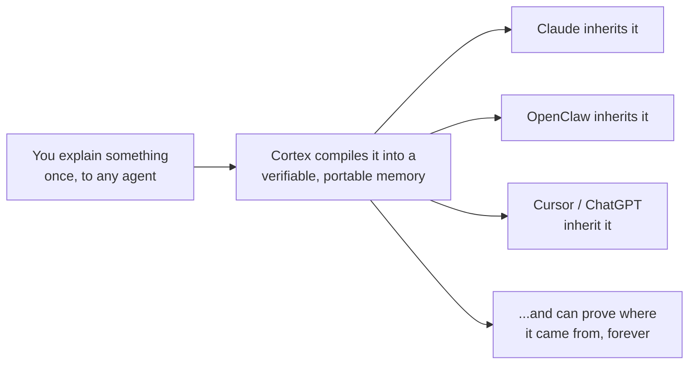
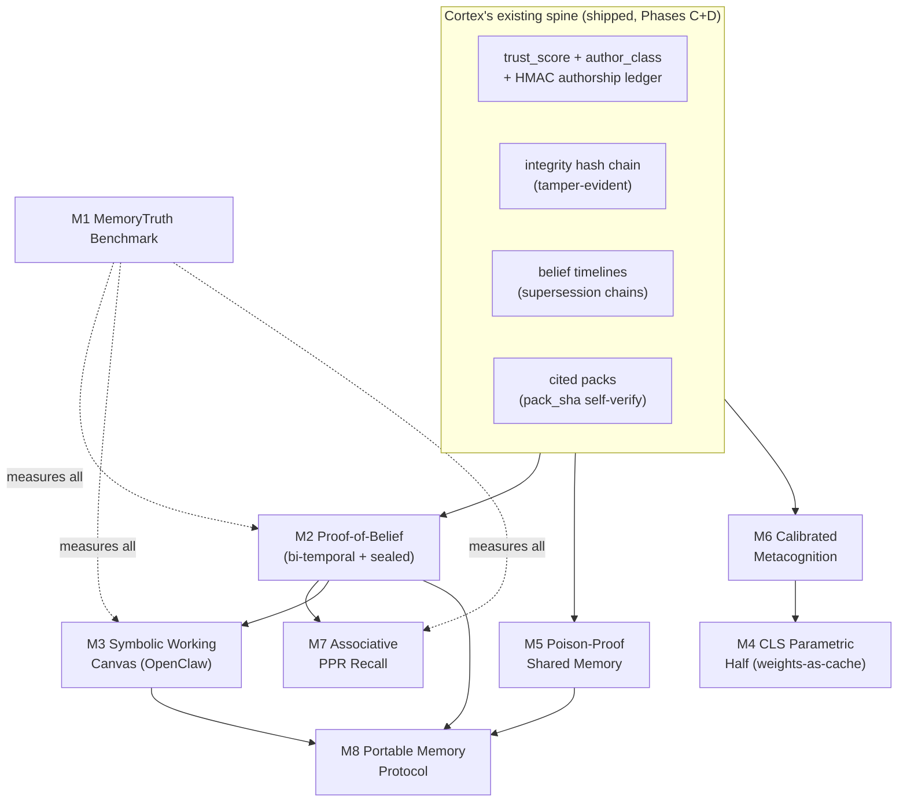

# Memory Moonshots: Where Cortex Goes Next

> Research + ideation doc. Grounded in (a) a deep survey of the state of the art in
> agent memory, (b) a mechanism-level teardown of TencentDB-Agent-Memory / OpenClaw,
> and (c) an inventory of Cortex's *real* current surfaces. Every Cortex claim below
> points at code that exists today. Every "revolutionary" claim is paired with a
> measurable objective so we can hill-climb it instead of hand-waving.

---

## 0. The one-sentence thesis

**Everyone else is building memory that is probabilistic, lossy, and unfalsifiable. Cortex is the only system positioned to build memory that is *verifiable*, and verifiable memory is the thing the whole field is missing.**

That sentence is the north star for every idea in this doc. Let me justify it, because it determines what we should build and what we should ignore.

---

## 1. What the research actually found (the honest version)

I had two research agents do deep, cited teardowns: one on the published SOTA (MemGPT/Letta, Mem0, A-MEM, Zep/Graphiti, HippoRAG, Generative Agents, Titans, sleep-time compute, GraphRAG, the cognitive-science lineage), one on TencentDB-Agent-Memory's real internals. Three findings matter more than all the others.

### Finding 1: The field's evaluation is broken, and everyone knows it

The two benchmarks the entire field cites, **LoCoMo** and **LongMemEval**, are partly broken. An independent audit (Penfield Labs, Apr 2026) found LoCoMo's answer key is **wrong 6.4% of the time** and its LLM judge **accepts 62.8% of intentionally-wrong-but-topically-adjacent answers**. That caps any "valid" LoCoMo score at ~93.6% and makes any gap under ~6 points pure judge noise. Vendors routinely report each other's systems mis-implemented (Zep showed Mem0's paper ran a broken Zep; Mem0's own numbers show a plain full-context baseline *beating* Mem0). **You cannot hill-climb on a broken objective.** This is the single biggest bottleneck in the field.

### Finding 2: Forgetting, provenance, and temporal belief are the unsolved core, and Cortex already has all three

The survey's "biggest unsolved problems" list reads like a description of features Cortex already shipped:

| Field's unsolved problem | What the SOTA does | What **Cortex already has** |
|---|---|---|
| **Forgetting is dangerous** (destructive summarize/DELETE silently corrupts) | Mem0 LLM-decides DELETE; everyone summarizes lossily | **Append-only supersession chains** (`superseded_by`, `get_belief_timeline`) - nothing is destroyed, stale revisions stay walkable |
| **Temporal belief revision** ("X was true, now Y") | Only Zep's bi-temporal model handles it; most overwrite and lose history | Belief timelines already stitch `superseded_by` chains and return each revision with its time |
| **Provenance / memory poisoning** (who wrote this? can it be trusted? was it tampered?) | "Real, under-studied attack surface" - nobody has shipped a defense | **`author_class` + `trust_score` + a per-memory HMAC authorship ledger + a tamper-evident integrity hash chain** (Phases C/D). Agent-authored memory is structurally forbidden from superseding user-authored memory. |
| **Evaluation is unfalsifiable** | Broken benchmarks, lenient judges | **Honest-metrics discipline + a self-grading twin** (`grade_twin_prediction`, `get_twin_scorecard`) that scores its own predictions against real outcomes |
| **Parametric vs non-parametric unreconciled** (the "real CLS prize") | External stores are editable but bolted-on; weight memory (Titans) is opaque, un-editable, no provenance | Cortex has the strong non-parametric half **plus** cited, verifiable packs (`pack_sha`, per-file `sha256` self-verification) - the right substrate to add the parametric half onto |

Read that table twice. **The features the entire research frontier is struggling toward are the features Cortex treated as table stakes.** The moonshots below are about pressing that advantage, not catching up.

### Finding 3: TencentDB's one genuinely great idea is a symbolic working-memory canvas, and it is lossless-by-construction

Stripping the marketing (the "skill generation" layer is literally vaporware in the OSS release - there is no local `l4-prompt.ts`, only a closed backend HTTP stub), TencentDB has exactly one idea worth stealing: **the Mermaid working-memory canvas.** During a long tool loop it offloads every raw tool result to disk (`refs/*.md`), keeps only a size-capped (<=4000 char) Mermaid state-graph in context, and stamps each graph node with a deterministic `node_id` (`001-N3`) that greps back to the raw evidence. It is lossless by construction (raw text always on disk) rather than lossy-summarization. Their credible claim is **30-60% input-token reduction on tool-heavy long-horizon tasks** (the token math is architecturally sound; the pass-rate percentages are unreproducible self-reported figures).

That pattern is worth taking. But notice: their `node_id` points at a plain file with no integrity guarantee. **Cortex would point each node at a receipt in the integrity chain.** Same ergonomics, but the working memory becomes auditable. That is the pattern for everything: take the good idea, add verifiability, and it becomes something no one else can copy without rebuilding Cortex's spine.

---

## 2. The strategic reframe

There are two ways to be "revolutionary" in memory right now:

- **Path A - win the capability race.** Better recall F1, more tokens saved, bigger graphs. This is a crowded street fight against Letta, Mem0, Zep, and Google, all of whom have more people and are all standing on the same broken benchmarks. We would be idea #47.

- **Path B - change what "memory" is allowed to mean.** Make memory *provable*: you can prove what it knew, when it knew it, who told it, whether it was tampered with, and whether it was right. Nobody is doing this, because nobody else built the provenance spine first. **This is Cortex's monopoly.**

Every moonshot below is chosen because it is **only buildable on Cortex**, or is dramatically stronger on Cortex than anywhere else. I am deliberately down-ranking pure capability plays (bigger graph, more compression) even when they're fun, because they don't compound the moat.

The grand vision, in the user's own framing - *"explain yourself to a computer once, ever"* - resolves cleanly under Path B:

"Explain once, ever" is impossible if memory is probabilistic (you'll re-explain because you can't trust it) and trivial if memory is verifiable (you explain once, it's provable, every agent inherits it). The moat *is* the mission.

---

## 3. The moonshots, ranked

Ranked by **(revolutionary impact) x (only-Cortex-can-build-it) x (measurability)**. Each has: the idea, why it's revolutionary, the exact SOTA gap it exploits, the **real Cortex surfaces** it builds on, a concrete build path, and a hill-climbable objective.

---

### Moonshot 1 - MemoryTruth: the honest, verifiable memory benchmark

**Tier: own the category. This is the highest-leverage thing we could possibly build.**

**The idea.** The field's #1 bottleneck is that its benchmarks are broken (Finding 1). Build the benchmark that isn't: contamination-resistant, long-horizon, single-fixed-judge, fully reproducible, with a **verifiable answer key**. The twist only Cortex can pull off: because Cortex answers are grounded in citations and integrity receipts, the "gold answer" for each probe can be *pinned to a provenance chain* rather than to a human's fallible label. The answer key becomes checkable, not just asserted.

**Why it's revolutionary.** Whoever owns the benchmark shapes the field. ImageNet made vision; GLUE/SQuAD made NLP. Agent memory has no trusted yardstick - the incumbents are actively embarrassed by LoCoMo. If Cortex ships *the* honest memory eval, then (a) every competitor benchmarks against us, (b) we set the definition of "good memory" to include provenance and abstention (dimensions we win), and (c) we get a real objective to hill-climb our own system on. This is a category-defining move disguised as a research artifact.

**SOTA gap.** LoCoMo (6.4% wrong keys, 62.8% lenient judge, corpus short enough that full-context beats "memory systems"). LongMemEval better but its abstention category is "where models crater" - and nobody measures provenance or tamper-resistance at all.

**Cortex surfaces it builds on.** The self-grading twin (`grade_twin_prediction`, `get_twin_scorecard`) is already an honest-eval engine. Integrity chains + `pack_sha` per-file verification give verifiable gold. The honest-metrics discipline is already a standing invariant.

**Build path.** (1) Define the task suite: multi-session recall, temporal belief revision (X-then-Y), abstention ("do you actually know this?"), and **provenance probes** ("who told you this and when?") - the last two are novel categories. (2) Generate scenarios procedurally with a held-out generator to resist contamination. (3) Single frozen judge, published prompt, published rubric, published seeds. (4) Ship a harness (`backend/bench/`) that runs any system behind an MCP or HTTP shim, so competitors can self-report reproducibly. (5) Publish a leaderboard where Cortex reports honestly, including its losses.

**Measurable objective.** The benchmark itself is the metric. Concretely: judge-agreement with the verifiable key >= 99% (vs LoCoMo's ~93.6% ceiling); inter-run variance < 1 point at fixed seed; and Cortex's own score on the abstention + provenance categories tracked release-over-release.

**Effort:** medium. **Moat:** maximal. **This is my #1 pick and I'll argue for it below.**

---

### Moonshot 2 - Proof-of-Belief: bi-temporal memory with a cryptographic audit trail

**Tier: technical leap that widens the moat.**

**Status (2026-07-10): shipped.** Explicit valid/transaction time, sealed snapshot and
supersession receipts, anchored hash-chain verification, historical snapshot search, and
MCP/FastAPI/standalone parity are green. The v1 verifier honestly proves receipt inclusion,
not arbitrary search completeness; an authenticated search index remains a future upgrade.

**The idea.** Cortex already has append-only supersession (valid-time, sort of) and an integrity hash chain (transaction ordering). Fuse them into a **full bi-temporal graph** (Zep's model: *valid-time* = when a fact was true in the world, *transaction-time* = when Cortex learned it) **but sealed by the integrity chain**, so every belief-state is not just queryable but *provable*. You can answer "what did you believe about X on March 3rd, and prove you're not retconning it?" - and the proof is a hash chain, not a promise.

**Why it's revolutionary.** This is memory for domains where being wrong is expensive and *auditability is mandatory*: medicine, law, finance, safety, compliance, journalism. "The AI changed its mind" is a liability today. "The AI changed its mind, here is the timestamped, tamper-evident record of exactly what it knew when and why it updated" is a *feature you can sell to a regulator*. No other memory system can do this because no other memory system has the hash chain. Zep has bi-temporal but no cryptographic seal; everyone else overwrites and loses history.

**SOTA gap.** Temporal reasoning is "consistently the worst category across benchmarks." Only Zep treats belief revision as first-class, and even Zep can't *prove* its history wasn't edited after the fact.

**Cortex surfaces.** `superseded_by` chains + `get_belief_timeline` (valid-time skeleton exists). The integrity chain (`chain_head`, `event_count`, `verify_integrity`, silent-tamper detection - all verified working in the build-22 bundle). Context packs already seal a snapshot with `pack_sha`.

**Build path.** (1) Add explicit `valid_from` / `valid_to` alongside the existing `superseded_by` (transaction ordering already exists via the chain). (2) New MCP tool `get_belief_proof(topic, as_of)` returning the belief-state *plus* the chain segment that proves it. (3) Extend `verify_integrity` to verify a *temporal slice* ("prove nothing between t1 and t2 was altered"). (4) `get_belief_timeline` gains an `as_of` param (point-in-time reconstruction). Backward-compatible: old packs still self-verify (we proved this pattern works when we fixed the context-pack identity bug).

**Measurable objective.** A temporal-reasoning + provenance test suite (feeds Moonshot 1): point-in-time reconstruction accuracy = 100% by construction; tamper on any historical revision detected 100% of the time; "as-of belief" query latency < 50ms on a 10k-memory vault.

**Effort:** medium. **Moat:** maximal (literally uncopyable without the chain).

---

### Moonshot 3 - The Symbolic Working-Memory Canvas (steal Tencent's trick, make it verifiable)

**Tier: borrow-and-improve, fast win, directly serves the OpenClaw attachment thesis.**

**The idea.** Adopt TencentDB's genuinely good idea - a size-capped symbolic graph as the *only* in-context representation of a long tool loop, with `node_id` back-pointers to raw evidence on disk - but replace their integrity-free file pointers with **receipts in Cortex's integrity chain.** Each node in the working-memory graph cites a receipt; drill-down is a verifiable read, not a trust-me read. Cortex becomes the working memory *and* the long-term memory for any tool-using agent (OpenClaw first).

**Why it's revolutionary (in context).** This is the concrete mechanism that makes the OpenClaw attachment real (see `OPENCLAW_ATTACHMENT_EXPLORATION.md`: "Cortex is the memory, OpenClaw is the hands"). It's the difference between "Cortex remembers your facts" and "Cortex is the substrate your agent thinks *in* during a task." And because every node is receipted, you get the token savings *and* an auditable trace of the agent's reasoning - something Tencent's version structurally cannot offer.

**SOTA gap.** TencentDB's canvas points at plain files (`refs/*.md`) with no tamper evidence; their whole system is "full of defensive fallbacks because the LLM frequently misbehaves" and the gateway is default-open. Cortex's receipted version is strictly safer.

**Cortex surfaces.** The integrity chain (receipts). Context packs (`build_context_pack`, `pack_sha`) are already "a sealed snapshot of what mattered" - a working-memory canvas is a *live, evolving* pack. The prefetch predictor (Phase 6) already anticipates what to pull.

**Build path.** (1) New surface `open_working_canvas(session)` that maintains a compact symbolic graph (start with the layer model we already have; Mermaid is just one rendering). (2) On each tool result, offload raw output to the vault, append a receipt, and update one graph node keyed by that receipt id. (3) Inject only the capped graph into context; drill-down = `get_context_pack`-style verified read of the receipt. (4) Token-budget knob analogous to their `mmdMaxTokenRatio`. (5) Wire it as an OpenClaw `contextEngine` plugin (Option B from the exploration doc).

**Measurable objective.** On a tool-heavy replay corpus: **input-token reduction >= 40%** (matching Tencent's credible number) with **drill-down retrieval accuracy = 100%** (guaranteed by receipts) and **zero silent evidence loss** (every node's raw text recoverable + hash-verified). These are exactly the metrics the Phase 6 prefetch harness already knows how to score.

**Effort:** medium. **Moat:** high (receipted). **Ships the OpenClaw story.**

---

### Moonshot 4 - Complementary Learning Systems: the parametric half (the "real prize")

**Tier: the deep technical bet. Highest ceiling, highest risk.**

**The idea.** The survey names this *the* unsolved prize: real CLS = a fast, editable, non-parametric store **plus** slow consolidation into parametric weights. Cortex has a best-in-class non-parametric half. Add the parametric half **the Cortex way**: during off-peak "sleep," consolidate the vault into a small **local personal adapter** (a LoRA-scale model) that answers frequent, stable recalls *without retrieval* - but the vault remains the source of truth, and every parametric answer is checked against a citation before it's trusted. The weights are a *cache*, never the authority.

**Why it's revolutionary.** This solves the exact dilemma the survey poses: external stores are inspectable but bolted-on and retrieval-limited; weight memory (Titans, TTT) is deep but "opaque, un-editable, no provenance, no proven multi-session agentic results." Cortex is the only one that can have *both halves and keep provenance*, because the parametric half is demoted to a speed cache that must agree with a cited source. "Fast like weights, honest like a citation" is a combination literally no one has shipped.

**SOTA gap.** "Nobody has shipped [real CLS] convincingly." Titans' memory is opaque parameters with no provenance - useless for an agent that must cite or correct. Cortex's citation gate fixes exactly that failure mode.

**Cortex surfaces.** The vault (source of truth). `pack_sha`/citation verification (the gate that keeps weights honest). Sleep-time is a natural fit for the existing background jobs. The twin scorecard measures whether the cache is actually right.

**Build path (staged, prove-first).** (1) *Sleep-time consolidation without weights first* - a background pass that resolves contradictions globally, extracts schemas, and pre-computes hot recalls into cached packs. Measure the win. (2) Only if that pays off, train a nightly local adapter on the consolidated, high-trust, non-superseded memories. (3) At query time, adapter proposes an answer; Cortex verifies it against a citation from the vault; on mismatch, fall back to retrieval and log the miss (feeds the twin scorecard). (4) Never let an unverified parametric answer reach the user - that's the whole discipline.

**Measurable objective.** Cold-recall (no retrieval) accuracy of the adapter vs the vault ground truth; parametric-answer *verification pass-rate* (must stay >= 99% or the cache is off); end-to-end recall latency (target: sub-100ms for cached hot memories vs retrieval baseline). Start by proving step 1 with a contradiction-rate-before/after metric.

**Implemented prove-first gate (MemoryTruth v7).** Stage 1 is now the production M4 boundary: a nightly, tenant-scoped consolidation job auto-resolves only high-trust conflicts with matching explicit claim scope, records every decision and proof in the same atomic SQLite transaction as supersession, and materializes hot context as immutable `pack_sha` references. Every cache read re-verifies the stored sha256, corpus revision, tenant ownership, and current citation ids; any mismatch is a cache miss. MemoryTruth v7 independently recomputes pack sha256, requires exact cold-vs-hot semantic parity, measures contradiction reduction, reports latency as a non-scoring diagnostic, and sabotages forged output plus frozen invalidation. Local adapter training remains deliberately deferred until a stronger proposal verifier and repeatable multi-size evidence show benefit beyond these verified hot packs. This avoids adding model/GPU dependencies merely because a single local latency sample improved.

**Effort:** high (this is the moonshot-iest moonshot). **Moat:** maximal. **Risk:** real - stage it, kill it early if step 1 doesn't pay.

---

### Moonshot 5 - Poison-Proof Shared Memory (verifiable memory for teams and swarms)

**Tier: opens a new market only Cortex can enter.**

**The idea.** The survey flags **memory poisoning** as "a real, under-studied attack surface" and multi-agent shared memory as an open trust problem. Cortex already has the defense primitives (HMAC authorship ledger, `trust_score`, `author_class`, agent-can't-supersede-user invariant, tamper-evident chain). Assemble them into the first **poison-resistant shared memory**: many agents and many people write to one memory; every write is attributed, trust-weighted, and tamper-evident; conflicting writes resolve by provenance and reputation, not by recency or loudness.

**Why it's revolutionary.** Every "team memory" / "org brain" / "agent swarm" product today is trivially poisonable - one bad agent or prompt-injected document corrupts the shared store for everyone, silently. Cortex can offer shared memory where **a malicious writer cannot silently overwrite a trusted fact**, and any tampering is detectable. That's the enterprise unlock: memory you can let multiple untrusted agents write to. It directly extends Phase C (source reputation) and Phase D (integrity) from single-user to multi-writer.

**SOTA gap.** "As agents share memory blocks (Letta) or a common graph, you get concurrency, trust, and attribution problems... Memory poisoning is a real, under-studied attack surface." No published defense exists.

**Cortex surfaces.** HMAC per-memory authorship ledger (detects `agent -> user` class flips). `trust_score` + `get_source_reputation`, `get_trust_summary`, `get_reliability_report` (Phase C). Integrity chain (Phase D). The existing supersede-authority invariant is already a poisoning defense - generalize it.

**Build path.** (1) Multi-writer identity: extend `author_class` beyond user/agent/connector to per-principal identities with keys. (2) Trust-weighted conflict resolution: when two principals write conflicting facts, resolve by (trust_score x reputation), record both in the belief timeline, never silently drop the loser. (3) `verify_shared_memory` = per-principal chain verification. (4) A "poisoning attempt" audit surface that flags low-trust writes that tried to supersede high-trust facts.

**Measurable objective.** Build a red-team suite of poisoning attacks (inject false facts as a low-trust agent, attempt class-flips, attempt silent supersession, attempt tamper). **Attack success rate must be 0%**, detection rate 100%, with false-positive rate on legitimate writes < 1%. Clean, adversarial, hill-climbable.

**Effort:** medium-high. **Moat:** maximal. **Market:** net-new (teams/enterprises/swarms).

---

### Moonshot 6 - Calibrated Metacognition: the memory that knows what it doesn't know

**Tier: makes the agent trustworthy; feeds the benchmark.**

**The idea.** The survey: "No good mechanism for 'I should know this but can't find it' metacognition... nobody has calibrated abstention well." Build it. Cortex's twin already grades its own predictions against outcomes - that's a calibration signal. Turn it into a **known-unknown detector**: before answering, Cortex estimates whether the answer is actually *in* its memory, and abstains (or asks) when it isn't, with a calibrated confidence.

**Why it's revolutionary.** The failure that destroys trust in AI memory is *confident retrieval failure* - the agent doesn't find the fact, doesn't realize it, and confabulates. An agent that reliably says "I don't have that, want to tell me?" instead of guessing is categorically more trustworthy. And "explain once, ever" *requires* this: the system must know when it genuinely doesn't have something (ask you once) versus when it does (never ask again).

**SOTA gap.** Abstention is "where models crater" (LongMemEval); nobody calibrates it well. Retrieval failures are silent everywhere.

**Cortex surfaces.** Twin scorecard (`grade_twin_prediction`, `get_twin_scorecard`) = a running calibration record. `ask_memory`, `get_open_questions` (already models known-unknowns as open loops). Trust scores give a confidence prior.

**Build path.** (1) A confidence estimator over retrieval results (coverage, agreement, trust of hits, recency). (2) Calibrate it against the twin's actual hit/miss outcomes (we already log these). (3) `ask_memory` returns a calibrated `confidence` + an explicit `known_unknown` flag; below threshold it abstains and offers to capture the missing fact (closing the "explain once" loop). (4) Track calibration error (ECE) over time as a first-class quality metric.

**Measurable objective.** Expected Calibration Error (ECE) on the twin's prediction log; abstention precision/recall on a probe set with deliberate known-unknowns; and a "confident-wrong rate" that must trend to near-zero. All directly measurable from data Cortex already collects.

**Effort:** medium. **Moat:** high (needs the twin's honest outcome log). **Trust unlock.**

---

### Moonshot 7 - Associative Recall via Personalized PageRank (HippoRAG for your personal graph)

**Tier: capability upgrade, well-understood, lower moat but strong compounding.**

**The idea.** HippoRAG 2's result is the cleanest win in the survey: Personalized PageRank over a knowledge graph gives **single-step multi-hop retrieval** (associative "spreading activation") without expensive iterative LLM calls - +7-9.5 F1 on associative/multi-hop tasks without hurting factual recall. Cortex has `get_memory_graph`. Add PPR over it so "what connects my Tuesday meeting to the budget decision to the person who emailed me" resolves in one hop-set instead of many retrieval round-trips.

**Why it's revolutionary (for Cortex).** It turns Cortex's graph from a visualization into a *reasoning substrate*. Combined with Moonshot 2's bi-temporal edges, you get associative recall that also respects "what was true when" - associativity + temporality is exactly the combination the survey says is unsolved.

**SOTA gap.** Most graph-memory systems "underperform plain vector RAG on basic factual recall" (the problem HippoRAG 2 was written to fix). Cortex's hybrid (vector + keyword already present) + PPR would get associativity *without* the factual regression, because it keeps the existing retrieval and adds PPR as a spreading layer.

**Cortex surfaces.** `get_memory_graph`, `get_entity_context`, `get_person_map`, `get_relationship_context` (the graph already exists and is rich). sqlite-vec + keyword hybrid retrieval (the seed set for PPR).

**Build path.** (1) Materialize the memory graph as an adjacency structure (entities, decisions, people, procedures as nodes; existing relations as edges). (2) Seed PPR from the hybrid-retrieval top-k for a query. (3) Spread; rank memories by accumulated node mass. (4) Fuse PPR score with the existing vector/keyword score (RRF, which we can reuse). (5) Add synonymy edges between near-duplicate entities.

**Measurable objective.** Multi-hop recall F1 on a probe suite (feeds Moonshot 1) vs the current hybrid baseline; target the HippoRAG-2-shaped win (+7 F1 on associative queries) with **no regression** on single-hop factual recall. Latency must stay single-round-trip.

**Effort:** medium. **Moat:** medium (technique is public) but compounds with 2. **Solid capability win.**

---

### Moonshot 8 - The Portable Memory Protocol ("bring your own brain")

**Tier: platform play. Biggest long-term vision, needs 1-3 as foundation.**

**The idea.** A signed, portable, vendor-neutral memory format + protocol so your Cortex memory works *across* Claude, OpenClaw, Cursor, ChatGPT, and whatever comes next - and every agent can verify the memory's provenance because it travels with its integrity chain. Memory stops being locked inside one vendor's product and becomes a **user-owned, portable, verifiable asset.**

**Why it's revolutionary.** This is the endgame of "explain yourself once, ever." Today your context is fragmented across a dozen tools and locked in each. If Cortex defines the portable format *and* it's the only one with a tamper-evident chain, then Cortex becomes the memory layer *for the entire agent ecosystem*, not one app. The integrity chain is the wedge: a portable memory you can't verify is worthless (anyone could forge it), so a *verifiable* portable format is the only one that can safely cross vendor boundaries. Cortex already exports (`export_memory`, `export_memory_bundle`) - this elevates export into a standard.

**SOTA gap.** Nobody has a verifiable portable memory format. Anthropic's memory tool is file-based and app-local; Letta's blocks are Letta-local; everyone is a silo. The survey's "multi-agent / shared memory and provenance" open problem is the small version of this.

**Cortex surfaces.** `export_memory_bundle`, `export_memory`, `import` sources (`list_supported_import_sources`). The dual-server shape (`/mcp` + `/v1` on :8766) is already the interop surface. Integrity chain makes exported bundles verifiable. `pack_sha` makes packs portable-and-checkable.

**Build path.** (1) Spec a signed bundle format: memories + belief timelines + integrity chain segment + a public verification key. (2) `export_verifiable_bundle` / `import_verifiable_bundle` with signature + chain verification on import (reject tampered bundles). (3) Reference adapters: an MCP server (works with Claude/any MCP client today) and an OpenClaw `contextEngine` plugin. (4) Publish the spec.

**Phase 1 implemented (July 2026).** `export_memory_bundle` established the signed import/export path with a stable vault-local Ed25519 identity, signer pinning, tenant-rebound ids, portable provenance and belief snapshots, supersession validation, idempotent replay, rollback-safe vault writes, and FastAPI/standalone/MCP parity.

**Phase 2 implemented (July 2026).** The published `cortex-portable-memory` protocol v2 uses exact authoritative UTF-8 payload bytes, strict outer/protocol version dispatch, algorithm-bound proof and signature preimages, a Draft 2020-12 schema, and a deterministic Python-produced cross-language test vector. The `@cortex/openclaw-context` reference plugin independently verifies signed bundles with signer pinning for offline recall, or injects cited live Cortex context through OpenClaw's current `contextEngine` lifecycle. The private v1 wire format remains compatibility-only; new exports use the language-neutral protocol v2 envelope.

**Phase 3 interoperability gate implemented (July 2026).** A deterministic N=3 Python-signed vector now crosses both receiving paths: Python import -> MCP search preserves all three source ids and full `portable_lineage`, while the OpenClaw bundle adapter recalls all three memory ids and source references plus the verified signer, source-tenant SHA-256 binding, continuity head, and payload digest. A defined 11-case signed-field tamper corpus is rejected 11/11, and strict offline mode fails closed on a modified bundle.

**Phase 4 real-runtime release gate implemented (July 2026).** The actual npm `.tgz` is installed, removed, and reinstalled through OpenClaw 2026.6.11 in a state-isolated profile. Runtime inspection proves `cortex-context` is activated in the exclusive `contextEngine` slot with its config schema and no diagnostics. Direct lifecycle probes against the installed artifact pass live context injection, review-endpoint capture, N=3 signed-bundle recall, and strict tamper rejection; a separate isolated loopback Gateway then boots healthy with the plugin loaded and zero plugin errors. The Gateway leg proves runtime registration and health, not a provider-backed model turn. The gate is repeatable via `python3 scripts/check_openclaw_context_release.py` or `npm run release:gate`.

**Measurable objective.** Cross-agent recall: export from Cortex, import into an OpenClaw/MCP client, verify N memories recalled with intact provenance and 100% signature-verification (tampered bundles rejected 100%). Adoption is the long-term metric; verification integrity is the shippable one.

**Effort:** high (protocol + adapters + evangelism). **Moat:** maximal if we're first. **The platform endgame.**

---

## 4. The map: how these compound

These are not eight separate bets. They form a stack where the verifiability spine (which Cortex already has) is the foundation, and each layer makes the next more valuable.

The benchmark (M1) is dotted because it *measures* everything else - it's the objective the other seven hill-climb against. That's why it's #1: it turns this whole doc from "ideas" into "an optimization problem with a scoreboard."

---

## 5. What I'd actually build first (my recommendation)

If the goal is maximum revolution per unit risk, build in this order:

1. **M1 (MemoryTruth benchmark) first, always.** It's medium effort, it's the highest-leverage single artifact in the field, and it gives every other moonshot a scoreboard. Without it we're guessing; with it we're optimizing. It also plays 100% to Cortex's honest-metrics DNA. **Start here.**

2. **M3 (Symbolic Working Canvas) next.** It's the concrete deliverable that makes the OpenClaw attachment real (the exploration doc's whole thesis), it has a credible pre-existing token-reduction number to beat, and M1 can score it immediately.

3. **M2 (Proof-of-Belief) in parallel.** It's mostly *elevating primitives Cortex already has* (supersession + chain -> bi-temporal + sealed), so it's lower-risk than it sounds, and it unlocks M7 and M8.

4. Then the higher-ceiling bets: **M6** (trust unlock, needs the twin log to mature), **M5** (new market), **M7** (capability), and finally **M4** and **M8** as the big swings once the foundation is proven.

The through-line: **we are not trying to have better memory than Letta. We are trying to make "memory you can prove" a category that exists, own it, and then let every other agent in the world plug into it.** That's the revolution that's actually available to Cortex, and it's available *because of what we already shipped in Phases A-D.*

---

## 6. Honest risks and what would kill each idea

I'd rather flag these now than discover them mid-build.

- **M1:** the risk is building a benchmark nobody adopts. Mitigation: make Cortex report on it honestly *including losses* (credibility), and make the harness trivially runnable by competitors. A benchmark only we can pass is worthless.
- **M2:** low technical risk (primitives exist); the risk is over-engineering the "proof" ergonomics. Keep the proof one tool call away.
- **M3:** risk is the LLM-discipline fragility that plagues TencentDB (their code is defensive fallbacks all the way down). Cortex's receipts *reduce* this (drill-down is verified, not trusted), but the graph-update logic needs the same care. Reuse the Phase 6 replay harness to catch regressions.
- **M4:** highest risk. The parametric cache could be wrong and expensive. **Mitigation is the whole design:** the citation gate means a wrong cache answer is *caught and discarded*, never shipped. And we prove step 1 (consolidation without weights) before spending a GPU-hour. Kill it early if step 1 doesn't pay.
- **M5:** risk is under-modeling real adversaries. Mitigation: the red-team suite *is* the spec - build attacks first, defenses second.
- **M6:** risk is a miscalibrated detector that abstains too much (annoying) or too little (untrustworthy). ECE is the guardrail; the annoyance-budget discipline from Phase 6 applies directly.
- **M7:** lowest moat (public technique). Fine as a capability win but don't over-invest; its value is in compounding with M2.
- **M8:** needs the ecosystem to care. Mitigation: ship the MCP adapter first (works with Claude *today*), prove single-user portability, and let adoption pull the rest.

---

*Grounding sources: SOTA survey (MemGPT/Letta arXiv:2310.08560, Mem0 arXiv:2504.19413, A-MEM arXiv:2502.12110, Zep/Graphiti arXiv:2501.13956, HippoRAG(2) arXiv:2405.14831 / 2502.14802, Generative Agents arXiv:2304.03442, Titans arXiv:2501.00663, Sleep-time compute arXiv:2504.13171, Anthropic context-engineering Sep 2025, GraphRAG arXiv:2404.16130; LoCoMo/LongMemEval audits Apr 2026). TencentDB-Agent-Memory mechanism teardown (src/offload/, src/core/, gateway). Cortex surfaces verified against `backend/app/storage.py`, `mcp_tools.py`, `standalone_server.py` at build 22. See also `docs/OPENCLAW_ATTACHMENT_EXPLORATION.md`.*
