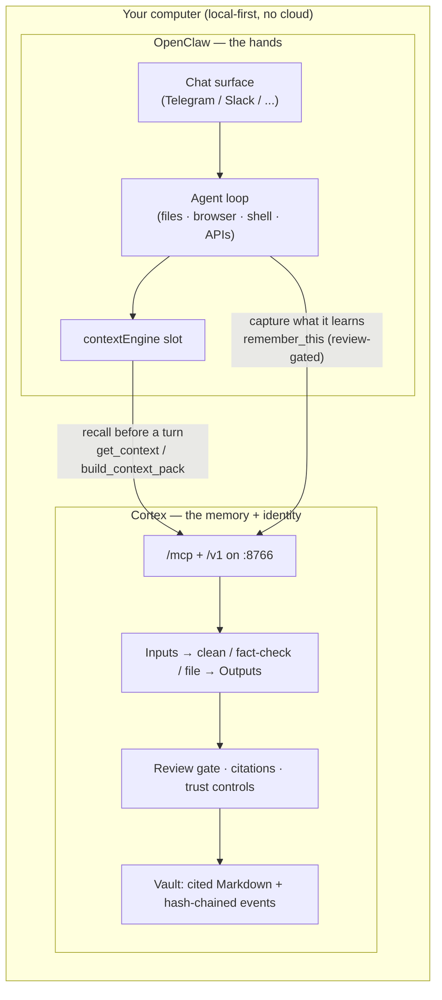

# Exploration: Cortex + OpenClaw — memory that has hands

Status: **exploration completed; reference adapter implemented in July 2026.** This document
records the investigation that led to the `@cortex/openclaw-context` package. The shipped thin
adapter follows the recommended attachment model: live cited Cortex recall or independently
verified signed-bundle recall through OpenClaw's `contextEngine` lifecycle. Broader desktop action
integration remains optional and outside Cortex's trust boundary.

---

## 1. The idea in one line

**Cortex knows who you are. OpenClaw does things on your computer. Wire them together and you
get an agent that already knows you and can actually act.**

Today Cortex is a memory and identity layer: it takes your emails, notes, chats, and calendar,
cleans and fact-checks them, and hands any AI a cited page about you. But Cortex itself does not
*do* anything on your machine. It has a brain, not hands.

OpenClaw is the opposite. It is a self-hosted agent that runs locally and has hands: access to
your files, browser, shell, and APIs, driven by natural language, connected to whatever LLM you
like (Claude, GPT, DeepSeek, or a local model via Ollama). What it lacks is a good, durable,
trustworthy memory of *you*. Out of the box it forgets between sessions, or it bolts on a
capture-everything memory plugin.

The user's phrase — "raw workhorse power done on their computer" — is OpenClaw. The question is
how Cortex becomes the memory that workhorse runs on.

---

## 2. What OpenClaw actually is (accurate, current)

- A **self-hosted, local-first agent framework** (formerly Clawdbot / Moltbot; ~180k GitHub
  stars). Runs on the user's own machine; "100% private, zero cloud dependency" is its pitch.
- It has **hands**: file system, browser, shell, and API access, plus home-automation style
  integrations. It runs long-horizon, can operate 24/7, and takes real actions rather than just
  answering.
- It is driven through **chat surfaces** (Discord, Slack, Telegram, WhatsApp, iMessage, Signal,
  Teams, and more) via channel plugins, and talks to any LLM backend.
- Critically for us, it has a **plugin system with typed slots**. One of those slots is
  `contextEngine` — the memory/context provider the agent consults before each turn. Plugins are
  installed with `openclaw plugins install ...` and configured in `~/.openclaw/openclaw.json`.

That `contextEngine` slot is the whole integration surface. It is a socket built for exactly the
thing Cortex is.

## 3. What the TencentDB plugin does (the pattern we already borrowed)

`TencentDB-Agent-Memory` is an OpenClaw (and Hermes) plugin that fills that memory slot. It is
MIT-licensed, TypeScript, local-only (SQLite + `sqlite-vec`). Two ideas:

1. **Layered long-term memory** — the pyramid we already studied: L0 Conversation (raw dialogue)
   → L1 Atom (atomic facts) → L2 Scenario (topic summaries) → L3 Persona (profile of you).
   Bottom layers live in a database; **top layers live as human-readable Markdown**, with a
   deterministic drill-down path from any summary back to the raw evidence. This is where Cortex's
   Phase A (Obsidian write-back: distilled, cited Markdown on top; queryable index underneath)
   came from. We took the pattern, not the code.

2. **Symbolic short-term memory** — inside one long task, verbose tool logs get offloaded to
   files and replaced with a compact Mermaid "canvas" carrying `node_id`s. The agent reasons over
   the tiny map and greps a `node_id` to pull the full log only when it needs a detail. Tencent
   reports this cuts OpenClaw token usage up to ~61% and lifts task pass rates. When we first
   looked at this we set it aside as "mid-task agent-framework stuff, not relevant to Cortex."
   **With OpenClaw now in the picture, it becomes relevant** — see §7.

How it plugs in: the plugin registers `slots: { contextEngine: "memory-tencentdb" }` and runs a
**local Gateway on `:8420`** exposing `capture` / `search` / `recall` HTTP endpoints, with
optional Bearer-token auth. OpenClaw calls that Gateway before each turn to recall context and
after turns to capture new memory.

**This is the exact shape Cortex already has.** Cortex's standalone server runs locally on
`:8766`, serves an MCP endpoint at `/mcp` and a REST API at `/v1/*`, and already exposes
`get_context`, `search_memory`, `build_context_pack`, `get_agent_adaptation`, `remember_this`,
and the agent-session tools. Cortex is a more capable version of the TencentDB Gateway, with a
review pipeline, citations, trust controls, and honest metrics on top.

---

## 4. The architectural fit

Read it as: **OpenClaw asks Cortex "who is this person and what do they want?" before it acts,
and tells Cortex "here's what I learned/did" after — through the review gate, never silently.**

The two systems are complementary, not competitive:

| | OpenClaw | Cortex |
|---|---|---|
| Core strength | Doing things on the machine | Knowing the person, provably |
| Memory | Session-scoped or capture-everything | Curated, fact-checked, cited, trust-gated |
| What it lacks | Durable trustworthy identity | Hands to act |
| Surface | `contextEngine` plugin slot | `/mcp` + `/v1` already live |

---

## 5. Cortex vs the TencentDB memory plugin — honest comparison

If a user is going to run OpenClaw, they will pick *a* memory plugin. Why Cortex over the
default TencentDB one?

**Where Cortex is stronger:**
- **Curation over capture.** TencentDB captures every conversation and extracts automatically.
  Cortex has a **review gate**: harvested/low-trust memories wait for a one-tap approve before
  they become first-party truth. An agent with hands acting on auto-captured, unreviewed memory
  is a bigger risk than a chatbot doing the same — curation matters *more* here, not less.
- **Citations and honest metrics.** Every Cortex memory can show its receipt; the scorecard,
  reputation read-model (Phase C), and answer-grading are real, not vibes. TencentDB's pyramid
  has drill-down to evidence but no trust scoring or faithfulness grading.
- **Provenance and integrity (Phase D).** Cortex can prove its history was not silently edited
  (hash-chained events) and hand over a self-verifying portable bundle. A workhorse agent editing
  memory as it runs is exactly the case where tamper-evidence earns its keep.
- **Real inputs, not just chat.** Cortex ingests email, calendar, Slack, GitHub, Notion, Obsidian,
  etc. TencentDB's long-term memory is built from agent conversations. Cortex knows you from your
  whole life, not just what you told the agent.
- **Source reputation → autonomy (Phase C).** Cortex already learns which sources you trust. That
  is the natural throttle for *how much latitude to give OpenClaw* per source.

**Where TencentDB does something Cortex does not:**
- **Symbolic short-term compression** (the Mermaid `node_id` offload) is genuinely useful for a
  workhorse mid-task, and Cortex has no equivalent. This is the one piece worth taking as a
  *pattern* the same way we took the Markdown-top-layer pyramid. See §7.

Net: for the **long-term memory slot**, Cortex is a strict upgrade. For **short-term in-task
compression**, TencentDB has an idea we lack.

---

## 6. Integration options (with tradeoffs)

Three concrete ways Cortex could attach to OpenClaw, cheapest first.

### Option A — MCP server (zero new Cortex code)
OpenClaw speaks to Cortex's existing `/mcp` endpoint as an MCP tool server. If OpenClaw can
consume MCP tools (directly or via a thin shim), `get_context` / `build_context_pack` /
`remember_this` are already there, already scoped, already trust-gated.
- **Pros:** nothing new to build in Cortex; rides the surface every other agent already uses;
  honors the existing read/write/export scopes and the review gate for free.
- **Cons:** depends on OpenClaw's MCP support; MCP tool-calling is coarser than the native
  `contextEngine` "recall before every turn / capture after every turn" auto-hooks. The agent has
  to *choose* to call the tools rather than getting context injected automatically.
- **Effort:** ~none in Cortex; a small OpenClaw-side config or shim.

### Option B — a thin `contextEngine` plugin (the real fit)
A small TypeScript OpenClaw plugin (~the size of TencentDB's client half) that fills the
`contextEngine` slot and **proxies to the local Cortex server** on `:8766`:
- `recall(query, session)` → `POST /v1/context` or `build_context_pack` (cited pack).
- `capture(turn)` → `remember_this` (lands in the **review inbox**, not straight into truth).
- session lifecycle → `start_agent_session` / `checkpoint_agent_session` / `resume_agent_session`.
- **Pros:** native auto-recall/auto-capture UX (the thing that makes TencentDB feel seamless),
  but backed by Cortex's curation, citations, trust gate, and integrity. Best user experience.
- **Cons:** a new (small) artifact to maintain in a second language/repo; needs a clean local
  auth handshake (Cortex API token with `read` + a review-gated `write`, mirroring TencentDB's
  Bearer-token Gateway pattern). Must respect `allow_agent_exports` before anything leaves custody.
- **Effort:** small-to-medium, mostly OpenClaw-side; Cortex likely needs **zero** new endpoints
  (Option B is a client of surfaces we already ship).

### Option C — deep merge (not recommended now)
Cortex hosts/embeds OpenClaw, or vice versa. Large surface, blurs the local-first trust boundary,
couples release cycles. No reason to do this before A/B prove the demand.

---

## 7. Reconsidering symbolic short-term memory

We earlier parked TencentDB's Mermaid offload as "not relevant to Cortex," and for *Cortex the
memory app* that was right. But the attachment reframes it: when **OpenClaw runs a long local
task**, that is precisely the mid-task token-explosion scenario the offload was built for. Two
honest positions:

1. **Leave it to OpenClaw/TencentDB.** Short-term in-task compression is an agent-runtime
   concern, not a memory-of-you concern. A user could run *both* plugins: Cortex in the
   long-term `contextEngine` role, TencentDB's offload for short-term. They do not conflict.
2. **Take the pattern later, if measured.** If we build Option B and see real workhorse
   sessions, we could add a Cortex-native "task canvas" (the same top-layer-symbol /
   drill-down-to-evidence discipline we already use for memory, applied to a live task log). But
   only if the token/latency numbers on real sessions justify it — same "measure before you add
   learning" bar we hold everywhere else. **Do not build this speculatively.**

Recommendation: position 1 now, position 2 as a *possible* future measured by real usage.

---

## 8. Standing invariants this must respect

Any attachment has to keep the promises the rest of Cortex keeps:
- **Cited-or-silent, extended to action.** OpenClaw acting on Cortex memory should be able to
  show *why* — the context pack it acted on is already a citeable, pinnable, hash-verifiable
  artifact (Phase 2 + Phase D). A workhorse that can act should also be able to prove what it knew.
- **Review gate for capture.** Anything OpenClaw learns lands in the inbox for one-tap approval,
  not silently into first-party truth. This is the whole reason to prefer Cortex over
  capture-everything memory.
- **Trust controls gate egress.** Handing memory to a local agent is read-scope; anything that
  leaves custody stays behind `allow_agent_exports` + export scope, exactly like today's exports,
  write-back, and portable bundle.
- **Local-first, honest metrics, both-servers + MCP parity** if any Cortex-side endpoint is ever
  added (Option B likely adds none).

---

## 9. Recommendation

1. **Prove it over MCP first (Option A).** Point an OpenClaw instance at Cortex's existing `/mcp`
   and confirm the loop: OpenClaw recalls a cited Cortex context pack before acting, and captures
   back through the review gate. Zero Cortex code; validates the whole thesis.
2. **If the loop feels right, build the thin `contextEngine` plugin (Option B)** for the native
   auto-recall/auto-capture UX, backed by Cortex's curation + trust + integrity. This is the
   product: *an agent with hands that already knows you, and can prove what it knew.*
3. **Keep short-term offload out of Cortex** unless real workhorse sessions measurably demand it.

The one-line pitch this unlocks: **"Cortex is the memory. OpenClaw is the hands. Together, an
agent on your own machine that already knows you — and only acts on memory you approved."**

---

*Companion to `docs/SESSION_CHECKPOINT.md`. Phases A-D (Obsidian write-back, session harvesting,
source reputation, integrity + portability) are shipped; this exploration is the bridge the user
asked for between that memory foundation and OpenClaw's local execution power. Next build: 22 + DMG
with everything aboard.*
