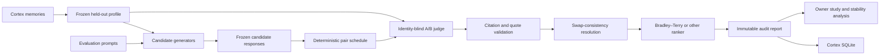
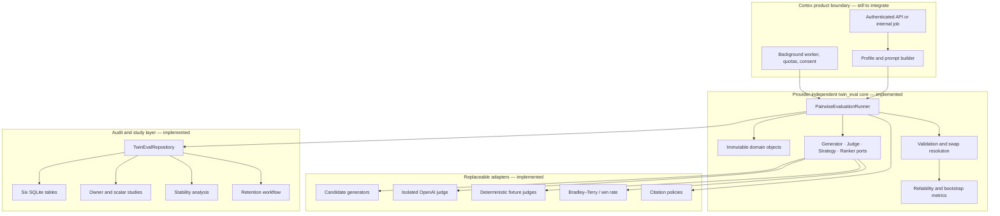
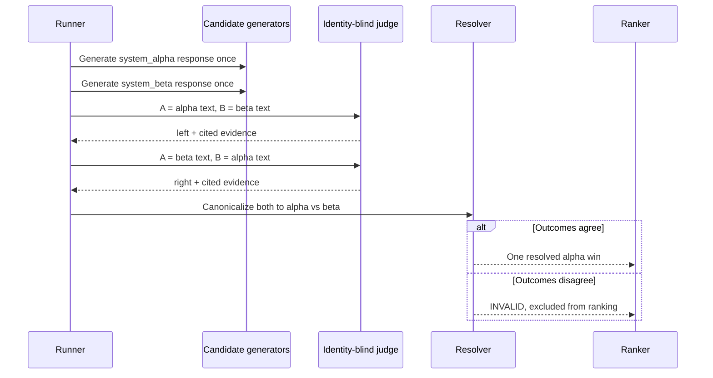
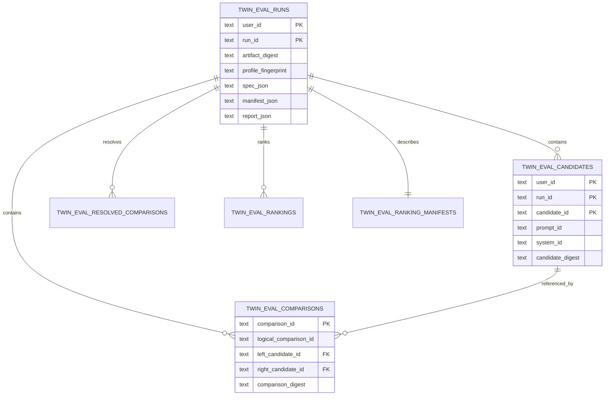
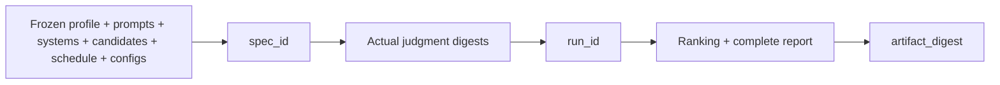
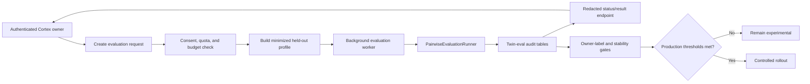

# Pairwise Digital-Twin Evaluation: Cortex Integration Guide

> **Read this first:** the evaluation engine, audit storage, deterministic
> benchmark, OpenAI judge adapter, owner-study workflow, stability analysis,
> and retention tooling are implemented locally. Product API routes, background
> jobs, consent controls, and real owner/provider calibration are **not**
> implemented. This is ready for controlled experiments, not end-user
> production.

This document is the onboarding guide for an engineer who has never seen the
feature. It explains what the feature is, how every layer works, what is
already implemented, and how to connect it to Cortex safely.

The deeper scientific review and benchmark record remains in
[PAIRWISE_TWIN_EVALUATION.md](./PAIRWISE_TWIN_EVALUATION.md).

---

## 1. The feature in 60 seconds

Pairwise Digital-Twin Evaluation answers:

> **“Given what Cortex knows about this person, which of these two candidate
> responses better matches their demonstrated preferences?”**

It does not ask a model to assign an isolated score. It freezes the same
profile, prompt, and candidate responses, shows two anonymous candidates to a
judge, reverses their display order, validates the cited memories, resolves the
two judgments, and ranks the candidate systems.



### Why this exists

Absolute ratings are useful for factual checks. They are less natural for
subjective properties such as tone, brevity, style, and personal taste.
Comparing two concrete answers:

- reduces ambiguity about what a score such as `7/10` means;
- exposes presentation-order bias by showing both A/B and B/A;
- keeps `tie`, `both_bad`, and `insufficient evidence` distinct;
- produces auditable evidence for every decisive preference;
- allows ranking algorithms to evolve without regenerating answers.

### What it does not do

It does not replace Cortex's existing `CortexStore.would_i()` scalar twin path.
It is a sibling experimental mode. It also does not prove that an LLM judge
understands the owner's taste: that requires blinded owner labels.

---

## 2. Exact implementation status

| Capability | Status | Meaning |
|---|---:|---|
| Provider-independent evaluation core | ✅ Implemented | Domain, scheduling, validation, resolution, ranking, and metrics have no model-provider dependency |
| Deterministic offline benchmark | ✅ Implemented | Runs locally without Anthropic, OpenAI, network access, or API credits |
| Optional OpenAI Responses judge | ✅ Implemented | Direct standard-library HTTP adapter with structured output, retries, timeouts, cancellation, and process isolation |
| Immutable SQLite audit storage | ✅ Implemented | Six dedicated, user-scoped tables with digest-verified replay |
| Blinded owner-label study | ✅ Implemented | Exports anonymous A/B cohorts, hidden reversed repeats, private keys, and cluster-aware analysis |
| Equivalent pointwise baseline | ✅ Implemented | Uses the exact same frozen candidates and preregistered thresholds |
| Repeat-run stability analysis | ✅ Implemented | Measures agreement, entropy, rank stability, confidence variance, latency, tokens, failures, and optional cost |
| Guarded retention workflow | ✅ Implemented | Preview/apply deletion with bounded batches and target-set digest protection |
| Pairwise-specific test coverage | ✅ Implemented | 95 targeted test methods pass after the latest study-validity review |
| Cortex REST/MCP route | ⛔ Not implemented | No external product route exposes this mode |
| Background execution queue | ⛔ Not implemented | The runner is synchronous; remote all-pairs jobs need a worker boundary |
| Real owner calibration | ⛔ Not completed | The study tooling exists, but real owner labels have not been collected |
| Real provider benchmark | ⛔ Not completed | No private profile data or API credits were used during implementation |
| Production consent, quotas, and budgets | ⛔ Not implemented | These must be added at the product boundary |

**Current approval:** approved for deterministic and controlled experimental
use. Not approved for end-user production routing.

---

## 3. Vocabulary

| Term | Definition |
|---|---|
| Held-out profile | An immutable snapshot of cited Cortex memories used only for one evaluation specification |
| Prompt | The task every candidate system answers |
| Candidate | One frozen response from one system for one prompt |
| Raw comparison | One presented judgment, such as candidate A on the left and B on the right |
| Logical comparison | The canonical system pair after presentation order is removed |
| Repetition | A new trial of the same prompt/system pair with its own deterministic seed |
| Swap | The same pair presented in the reverse order |
| Judge | An adapter that chooses `left`, `right`, `tie`, `both_bad`, or `abstain` |
| Citation policy | The trusted validator that decides whether a judgment's cited evidence is allowable |
| Resolved comparison | One normalized result produced from the A/B and B/A judgments |
| Ranker | A replaceable backend that converts resolved comparisons into system ratings |
| `spec_id` | Identity of the frozen experimental specification, inputs, candidate outputs, schedule, and component configuration |
| `run_id` | Identity of one execution, including its judgments, ranking, and optional replicate ID |
| `artifact_digest` | SHA-256 identity of the entire persisted report |

---

## 4. Outcomes and their meaning

The judge contract keeps six outcomes separate.

| Outcome | Meaning | Ranking treatment |
|---|---|---|
| `left` | Left candidate is better supported by the owner profile | Left receives a win |
| `right` | Right candidate is better supported by the owner profile | Right receives a win |
| `tie` | Both are equally preferred | Each receives half a win |
| `both_bad` | Both fail an absolute quality or hard-constraint floor | Excluded and counted |
| `abstain` | The profile lacks sufficient relevant evidence | Excluded and counted |
| `invalid` | The judgment, citation, schedule, or swap resolution is unusable | Excluded and counted |

This distinction matters. Treating `abstain` as a tie would fabricate preference
signal from missing evidence. Treating `both_bad` as a tie would reward two
responses that both violated the owner's constraints.

---

## 5. Technical architecture

The implementation uses a ports-and-adapters shape. The central runner depends
on four small protocols, not on Cortex storage or a specific model vendor.



### The four extension ports

| Port | Required behavior | Included implementations |
|---|---|---|
| `CandidateGenerator` | Generate one candidate for a prompt/profile/seed and return the exact assigned identity | `DeterministicGenerator`; product adapters are still needed |
| `PairwiseJudge` | Judge anonymous A/B text against the cited profile | `ObservableFeatureJudge`, `OracleJudge`, `IsolatedOpenAIResponsesJudge` |
| `ComparisonStrategy` | Produce a deterministic, valid comparison schedule | `AllPairsStrategy`, `AnchorStrategy`, `RepeatedSwappedStrategy` |
| `RankingBackend` | Rank normalized logical comparisons | `BradleyTerryRanker`, `WinRateRanker` |

### Source-file map

| File | Responsibility |
|---|---|
| `backend/app/twin_eval/domain.py` | Immutable schemas, canonical JSON, hashes, derived seeds, report identities |
| `backend/app/twin_eval/protocols.py` | Four extension protocols and deterministic fixture adapters |
| `backend/app/twin_eval/strategies.py` | All-pairs, anchor, repetitions, and balanced swapped schedules |
| `backend/app/twin_eval/runner.py` | Orchestration, quotas, candidate caching, blinding, validation, resolution, identity |
| `backend/app/twin_eval/ranking.py` | Bradley–Terry MM and win-rate ranking |
| `backend/app/twin_eval/metrics.py` | Reliability, bias, and cluster-aware bootstrap intervals |
| `backend/app/twin_eval/observable.py` | Deterministic mechanical oracle for tests and benchmarks |
| `backend/app/twin_eval/policies.py` | Eligible, prompt-scoped, and quoted-evidence citation validation |
| `backend/app/twin_eval/openai_judge.py` | Optional process-isolated OpenAI Responses adapter |
| `backend/app/twin_eval/repository.py` | Immutable SQLite persistence, replay verification, deletion, and purge |
| `backend/app/twin_eval/owner_study.py` | Blinded pairwise owner-label cohort and analysis |
| `backend/app/twin_eval/scalar_study.py` | Equivalent blinded pointwise baseline |
| `backend/app/twin_eval/stability.py` | Same-spec stochastic repeat analysis |
| `backend/bench/pairwise_twin.py` | 24-case adversarial deterministic benchmark |
| `scripts/pairwise_twin_*.py` | Evaluation, owner study, stability, and retention commands |

---

## 6. End-to-end execution lifecycle

One call to `PairwiseEvaluationRunner.run()` performs this sequence:

1. **Freeze and validate the specification.** It snapshots metadata and adapter
   configuration, validates prompt and system uniqueness, applies input/count
   ceilings, and derives a stable root seed.
2. **Create and validate the schedule.** It rejects empty schedules, duplicate
   comparison IDs, duplicate logical trials, incorrect swap pairs, unknown
   systems, and missing prompt/system coverage.
3. **Generate each candidate once.** One candidate is produced per
   `(prompt_id, system_id)` and cached, even when it appears in many comparisons.
4. **Judge anonymous presentations.** The runner replaces candidate IDs, system
   IDs, seeds, and metadata with `candidate_a` and `candidate_b` views before
   calling a production judge.
5. **Validate, resolve, rank, and identify.** Citation failures become
   `invalid`; swapped judgments must agree after canonicalization; the ranker
   sees each logical outcome once; the runner emits `spec_id`, `run_id`, and a
   complete report digest.

### Candidate generation and comparison count

For `P` prompts, `S` systems, `R` repetitions, and both display orders:

```text
candidate generations = P × S
logical pairs         = P × S × (S - 1) / 2 × R
raw judge calls       = logical pairs × 2
```

At three systems and three repetitions, this is 18 raw judge calls per prompt.
The equivalent pointwise baseline uses three ratings per prompt, so the raw
pairwise call count is 6× larger.

---

## 7. Blinding and swap resolution

Position bias is handled structurally, not by asking the judge to ignore it.



The ranker never receives two wins from the two presentations. It receives one
resolved logical outcome. This prevents swapped presentations from
double-counting evidence.

### Identity leakage protection

By default, the judge sees:

```text
candidate_id = candidate_a / candidate_b
system_id    = candidate_a / candidate_b
seed         = 0
metadata     = {}
```

Only fixture judges that explicitly require real identities may use
`blind_judge_inputs=False`. That setting is not suitable for product
evaluation.

### Identical and nearly identical responses

NFKC-identical candidate text cannot receive a decisive left/right result. A
decisive result is converted to `invalid`, because it implies identity or
position leakage. Identical answers may still legitimately produce `tie`,
`both_bad`, or `abstain`. Nearly identical answers remain normal evaluation
inputs and should be over-sampled in real calibration.

---

## 8. Profile evidence and citation safety

The profile is a frozen tuple of `CitedProfileItem` objects. Every item contains
at least:

```python
CitedProfileItem(
    memory_id="memory_123",
    content="I prefer concise status updates with the decision first.",
    author_class="user",
    status="active",
    trust_score=1.0,
)
```

The default policy allows only unique memory IDs that are:

```text
owner-authored + active + positive trust + present in the frozen profile
```

A decisive left/right judgment must cite at least one such memory.

### Policy choices

| Policy | Use when | Guarantee |
|---|---|---|
| `EligibleCitationPolicy` | Minimum provenance floor | IDs exist and are eligible owner evidence |
| `PromptScopedCitationPolicy` | The profile builder can preregister relevance per prompt | Cited IDs are eligible and in that prompt's allowlist |
| `QuotedEvidenceCitationPolicy` | The judge returns evidence quotes | Every cited quote occurs in its claimed frozen memory after NFKC normalization |

The quoted policy proves quote occurrence, not semantic entailment. Cortex must
not claim that a citation supports a rationale merely because the quoted
substring exists. Production still needs either a calibrated semantic verifier
or sampled human review.

### The Cortex profile builder is a trust boundary

The future profile builder must decide:

- which memories are relevant to the evaluation prompt;
- how contradictory memories are ordered or scoped;
- which source, status, author, and trust signals are acceptable;
- what profile data may leave the local Cortex boundary;
- whether the owner consented to this experiment.

The runner enforces the resulting frozen snapshot. It does not make those
product-policy decisions itself.

---

## 9. Judge implementations

### Deterministic judges

`OracleJudge` and `ObservableFeatureJudge` exist for testing, demos, and
mechanical validation. The observable oracle applies declared hard constraints
before soft preferences, normalizes Unicode, removes zero-width format
characters, and applies conservative multi-script character boundaries.

These judges are intentionally circular at the semantic layer: the benchmark
rules and expected results come from the same fixture definition. They prove
the machinery works, not that the feature understands a person.

### OpenAI Responses judge

`IsolatedOpenAIResponsesJudge` is the optional remote adapter. It:

- calls `/v1/responses` directly with Python's standard library;
- requires strict JSON structured output and sends `store: false`;
- treats profile, prompt, and candidate strings as untrusted quoted data;
- uses a separate spawned process for each comparison;
- converts failures into auditable `invalid` results instead of aborting a run.

Its default configuration is:

| Setting | Default |
|---|---:|
| Model | `gpt-5.6-luna` |
| Credential environment variable | `OPENAI_API_KEY` |
| Request timeout | 20 seconds |
| Parent hard timeout | 60 seconds |
| Retries after the first attempt | 2 |
| Maximum output | 1,200 tokens |
| Reasoning effort | `low` |

It retries network failures, timeouts, HTTP 408/409/429, and 5xx responses with
bounded backoff. `cancel()` terminates active child processes. Error bodies are
discarded because providers may echo private prompt content.

The recorded metadata includes provider model, response ID, attempts, provider
latency, token usage, confidence, failure class, and optional cost. Cost is
calculated only when explicit per-million-token prices are supplied; the
adapter does not embed prices that can become stale.

### No Anthropic dependency

The core has no Anthropic dependency. The deterministic benchmark uses no
remote provider. The only implemented production-style remote adapter is the
optional OpenAI Responses adapter. No real remote call was made while building
or testing this feature.

---

## 10. Ranking and reliability

### Bradley–Terry backend

`BradleyTerryRanker` uses a pure-Python minorization-maximization fit with a
symmetric prior. It reports:

| Diagnostic | Why it matters |
|---|---|
| Connected components | Scores across disconnected comparison graphs are not identifiable |
| Convergence and iterations | Shows whether optimization reached its tolerance |
| Data log likelihood | Supports fit comparison and debugging |
| Fractional wins and counts | Makes the ranking inputs auditable |
| Ignored outcome counts | Prevents `both_bad`, `abstain`, and `invalid` from disappearing |

Ties contribute half a win per system. Disconnected graphs receive only
component-local ranks; the implementation refuses to invent a global order.
Equal scores share a dense rank.

`WinRateRanker` consumes the same resolved outcomes. A future ranker only needs
to implement `RankingBackend`, which keeps ranking experiments separate from
generation and judging.

### Reliability metrics

The metrics layer measures:

| Metric | Interpretation |
|---|---|
| Swap agreement | Whether A/B and B/A give the same canonical result |
| Repeat agreement | Whether repetitions of the same pair remain consistent |
| Position bias | Whether the displayed left/right position changes wins |
| Invalid rate | Portion of judgments unusable after validation |
| Confidence coverage | Portion of judgments that report confidence |

Clustered bootstrap functions resample at the prompt/case level. This avoids
pretending that many comparisons from one prompt are independent observations.

### Stochastic repeat analysis

Two or more reports with the same nonempty `spec_id` and distinct `run_id`
values can be compared using `analyze_stability_reports()`. Pass a unique
`trial_id` to each execution so byte-identical judgment results remain
independently addressable instead of collapsing to one content-addressed run.
The analysis measures modal outcome agreement, normalized entropy, pairwise
inter-run agreement, top-rank stability, confidence mean/variance, provider
latency percentiles, token totals, optional estimated cost, and failure counts.

Top-rank stability is `null` when any included run has no global rank, such as
a disconnected comparison graph. Available and missing top-rank run counts are
reported separately, preventing an empty rank set from appearing perfectly
stable.

Provider latency excludes queue and process-start wall time. Product
instrumentation must measure total job latency separately.

---

## 11. Persistence and exact replay

Evaluation data is intentionally stored outside `memory_events`.



`TwinEvalRepository` stores compact schema
`pairwise-twin-artifact/v2`. Candidate text is stored once in the compact
report, while comparison records refer to candidate IDs. Normalized candidate
rows remain available for independent audit verification. The reader remains
compatible with expanded v1 artifacts.

### Storage guarantees

- Every operation is scoped by `(user_id, run_id)`.
- Re-saving exactly the same artifact is idempotent.
- Different bytes under the same run ID raise
  `EvaluationArtifactCollision`.
- `replay_bundle()` cross-verifies the report, specification, manifest,
  candidates, comparisons, resolutions, ratings, ranking, and every digest.
- Deletion is atomic and may require the expected artifact digest.

Foreign keys use `ON DELETE RESTRICT`. Repository deletion removes child rows
in a fixed order inside one transaction, preventing partial audit bundles.

---

## 12. Reproducibility model

The implementation separates three identities so deterministic and stochastic
runs can coexist correctly.



| Identity | Changes when | Use |
|---|---|---|
| `spec_id` | Frozen inputs, generated candidates, schedule, runner limits, or adapter configuration changes | Group repeated stochastic trials of the same experiment |
| `run_id` | The judgments, ranking, or explicit `trial_id` change | Address one execution or replicate |
| `artifact_digest` | Any serialized report content changes | Verify exact replay and persistence integrity |

Canonical JSON and SHA-256 create stable hashes. Stage-specific child seeds are
derived from the root seed, profile fingerprint, prompt, system, and operation.
Execution order is included in the frozen specification because a remote or
stateful adapter could observe it.

Fresh remote model calls are not mathematically reproducible. Exact
reproducibility means replaying the frozen artifact; repeated fresh calls
measure stability. Use a stable unique label such as `pilot-01-run-003` as the
`trial_id` for each replicate. The trial ID changes `run_id` and
`artifact_digest`, but not `spec_id`, candidates, schedule, or judgment seeds.

---

## 13. How to run what exists today

Run these commands from the repository root.

### A. Deterministic benchmark

```bash
python3 scripts/pairwise_twin_eval.py
```

Persist it to a Cortex database:

```bash
python3 scripts/pairwise_twin_eval.py \
  --seed 7 \
  --db-path /path/to/cortex.sqlite \
  --user-id USER_ID
```

Verify and replay it without printing private content:

```bash
python3 scripts/pairwise_twin_eval.py \
  --db-path /path/to/cortex.sqlite \
  --user-id USER_ID \
  --replay-run-id twin_eval_...
```

### B. Blinded owner-label study

```bash
python3 scripts/pairwise_twin_owner_study.py export \
  --db-path /path/to/cortex.sqlite \
  --user-id USER_ID \
  --run-id twin_eval_... \
  --public-out owner-cohort.json \
  --key-out owner-cohort.private.json \
  --labels-out owner-labels.json \
  --seed 7
```

The labeler receives only `owner-cohort.json` and records `a`, `b`, `tie`,
`both_bad`, or `abstain`. Keep the private decoding key away from the labeler.
The command writes that key with mode `0600`.

Analyze completed labels:

```bash
python3 scripts/pairwise_twin_owner_study.py analyze \
  --db-path /path/to/cortex.sqlite \
  --user-id USER_ID \
  --public owner-cohort.json \
  --key owner-cohort.private.json \
  --labels owner-labels.json \
  --output owner-analysis.json
```

Primary owner agreement uses one original label per independent pair. Hidden
reversed repeats are excluded from that estimate and used only for repeat
reliability and displayed-position diagnostics, so the repeated subset cannot
receive extra statistical weight. Before analysis, the public cohort and
private decoding key are deterministically reconstructed from the verified
source report; edited prompts, responses, mappings, or item order are rejected.

### C. Equivalent pointwise baseline

```bash
python3 scripts/pairwise_twin_owner_study.py scalar-export \
  --db-path /path/to/cortex.sqlite \
  --user-id USER_ID \
  --owner-key owner-cohort.private.json \
  --public-out scalar-cohort.json \
  --key-out scalar-cohort.private.json \
  --scores-out scalar-scores.json

python3 scripts/pairwise_twin_owner_study.py scalar-baseline \
  --owner-key owner-cohort.private.json \
  --scalar-key scalar-cohort.private.json \
  --scores scalar-scores.json \
  --output scalar-baseline.json \
  --tie-margin 2 \
  --both-bad-at-or-below 10
```

Pass `--baseline scalar-baseline.json` to the owner-study `analyze` command.
The baseline is cryptographically bound to the source run, owner cohort,
candidate set, completed scores, and thresholds.

### D. Repeat-run stability

```bash
python3 scripts/pairwise_twin_stability.py \
  --db-path /path/to/cortex.sqlite \
  --user-id USER_ID \
  --run-id twin_eval_trial_1 \
  --run-id twin_eval_trial_2 \
  --output stability.json
```

The runs must share the same `spec_id`.

### E. Retention

Preview first:

```bash
python3 scripts/pairwise_twin_retention.py preview \
  --db-path /path/to/cortex.sqlite \
  --user-id USER_ID
```

Apply the exact preview:

```bash
python3 scripts/pairwise_twin_retention.py apply \
  --db-path /path/to/cortex.sqlite \
  --user-id USER_ID \
  --expected-preview-digest retention_preview_...
```

The default is 90 days, configurable with
`CORTEX_TWIN_EVAL_RETENTION_DAYS`. Batches default to 100 and cannot exceed
1,000. Scheduling is intentionally delegated to Cortex's existing deployment
scheduler.

---

## 14. Minimal Python integration

The core is already importable from `backend.app.twin_eval`.

```python
from pathlib import Path

from backend.app.database import init_db
from backend.app.twin_eval import (
    BradleyTerryRanker,
    CitedProfileItem,
    DeterministicGenerator,
    EvaluationPrompt,
    HeldOutProfile,
    PairwiseEvaluationRunner,
    QuotedEvidenceCitationPolicy,
    RepeatedSwappedStrategy,
    TwinEvalRepository,
    IsolatedOpenAIResponsesJudge,
)

db_path = Path("/path/to/cortex.sqlite")
user_id = "owner_123"

profile = HeldOutProfile(
    profile_id="heldout_profile_2026_07_24",
    items=(
        CitedProfileItem(
            memory_id="memory_123",
            content="I prefer concise answers with the decision first.",
            author_class="user",
            status="active",
            trust_score=1.0,
        ),
    ),
)

prompts = (
    EvaluationPrompt(
        prompt_id="prompt_001",
        text="Write a status update for the owner.",
    ),
)

# Replace these deterministic functions with Cortex candidate-system adapters.
generators = (
    DeterministicGenerator(
        "current_cortex",
        lambda prompt, profile, seed: "Decision: ship the fix. Two tests remain.",
    ),
    DeterministicGenerator(
        "candidate_cortex",
        lambda prompt, profile, seed: "Here is a long introduction before the decision...",
    ),
)

runner = PairwiseEvaluationRunner(
    generators=generators,
    judge=IsolatedOpenAIResponsesJudge(),
    strategy=RepeatedSwappedStrategy(repetitions=2),
    ranker=BradleyTerryRanker(),
    citation_policy=QuotedEvidenceCitationPolicy(),
    metadata={"experiment": "cortex_pairwise_pilot_v1"},
)

report = runner.run(
    profile,
    prompts,
    seed=20260724,
    trial_id="pilot-01-replicate-001",
)

init_db(db_path)
repository = TwinEvalRepository(db_path)
repository.save_report(user_id, report)
repository.replay_bundle(user_id, report.run_id)
```

This example requires `OPENAI_API_KEY` because it selects the remote judge.
Use a deterministic fixture judge for offline development. A real integration
should also use `PromptScopedCitationPolicy` inside the quoted-evidence policy
after the Cortex profile builder has created per-prompt evidence allowlists.

---

## 15. How to integrate it with Cortex overall

The safest product shape is an asynchronous internal experiment service, not a
new synchronous branch inside `would_i()`.



### Recommended integration sequence

1. **Build the profile adapter — 0.5 to 1 engineering day.** Query Cortex
   memories under the authenticated `user_id`, minimize and redact content,
   resolve relevance/contradictions, and produce `HeldOutProfile` plus
   per-prompt citation allowlists.
2. **Build candidate adapters — 0.5 to 1 engineering day.** Wrap the current
   Cortex response path and each challenger behind `CandidateGenerator`;
   preserve the exact assigned seed and never regenerate candidates during
   comparisons.
3. **Add an authenticated async job boundary — 1 to 2 engineering days.**
   Accept an experiment request, verify ownership and consent, enqueue the run,
   support cancellation, and expose a redacted status/result view.
4. **Add operational controls — about 1 engineering day.** Enforce provider
   allowlists, per-user prompt/system/call/token budgets, total job timeout,
   logging redaction, scheduler-driven retention, and alerting on invalid or
   failure rates.
5. **Run the calibration gate — 1 to 3 engineering days plus owner labeling.**
   Freeze a new cohort, collect blinded pairwise and pointwise owner labels,
   repeat remote trials, preregister thresholds, and approve rollout only if
   agreement, stability, latency, and cost pass.

These are implementation estimates, not commitments; the existing Cortex job
and consent infrastructure may shorten or extend them.

### Do not connect it directly to `would_i()`

The existing scalar twin endpoint returns one calibrated prediction. Pairwise
evaluation compares multiple generated responses and can make many remote
calls. Combining them now would:

- change the latency and cost contract of an existing endpoint;
- mix scalar prediction calibration with experimental ranking;
- make consent and retention harder to explain;
- risk exposing private profile evidence to a provider implicitly;
- remove the clean ability to turn the experiment off.

Keep pairwise evaluation behind an explicit experiment route or internal job
until the owner study and remote stability gates pass.

### Suggested product API shape

This is a design recommendation, not implemented code.

```text
POST   /v1/twin/evaluations/pairwise
GET    /v1/twin/evaluations/pairwise/{run_id}
POST   /v1/twin/evaluations/pairwise/{run_id}/cancel
DELETE /v1/twin/evaluations/pairwise/{run_id}
```

The create request should reference server-side prompt and system
configurations rather than accepting arbitrary provider URLs or credentials.
The response should expose status, redacted metrics, ranking diagnostics, and
IDs—not raw profile memories or private judge rationales by default.

---

## 16. Security, privacy, and operations

### Data leaving Cortex

A remote judge receives the evaluation prompt, minimized held-out profile
content, and both candidate texts. `store: false` reduces provider retention
but does not replace owner consent or Cortex's data-processing policy.

Before a remote run, the product boundary must enforce:

| Control | Required behavior |
|---|---|
| Explicit consent | Tell the owner that selected memory content and candidates will be sent to the configured provider |
| Profile minimization | Include only evidence necessary for the frozen prompts |
| Redaction | Remove secrets, credentials, unrelated people, and prohibited data classes |
| Provider allowlist | Select server-controlled adapters and models; never accept an arbitrary endpoint from a client |
| Ownership | Scope every request, read, replay, cancellation, and deletion by authenticated `user_id` |
| Quotas and budgets | Bound prompts, systems, comparisons, total tokens, provider spend, and concurrent jobs |
| Retention | Schedule the preview/apply workflow and document the policy |
| Logging | Store failure classes and hashes; keep profile/candidate content out of application error logs |

### Existing runner ceilings

| Limit | Default |
|---|---:|
| Prompts | 1,000 |
| Systems | 100 |
| Raw comparison plans | 100,000 |
| Canonical input characters | 2,000,000 |
| Canonical characters per candidate | 200,000 |
| Judge rationale characters | 100,000 |
| Complete report characters | 50,000,000 |

These ceilings are safety rails, not sensible production defaults. Product
limits should be much smaller and budget-aware.

---

## 17. Benchmark and test evidence

### Deterministic benchmark

The versioned `subjective-mechanical-v1` fixture contains 24 cases across six
strata: clear style, negative constraints, near ties, contradictory profile
signals, sparse/noisy evidence, and deceptive/adversarial responses.

Three systems are compared for every case. Every pair is shown in both orders
and repeated three times. Validated seeds 7, 41, and 97 each produced:

| Result | Value |
|---|---:|
| Raw judgments | 432 |
| Resolved logical comparisons | 216 |
| Synthetic pair-label accuracy | 1.0000 |
| Swap agreement | 1.0000 |
| Repeat agreement | 1.0000 |
| Position bias | 0.0000 |
| Invalid rate | 0.0000 |
| Hard-constraint-violating winner rate | 0.0000 |
| Ranking | Connected, converged, `strong > partial > mismatch` |

At seed 7, pairwise recovery was `1.0000`; a synthetic five-bin comparator was
`0.9861`; the paired prompt-cluster bootstrap delta was `+0.0139` with a 95%
interval of `[0.0000, 0.0417]`.

The interval includes zero. This is not evidence of a reliable pairwise
advantage. It is evidence that the implementation recovers its declared
mechanical rules.

### Test status

The latest pairwise-focused verification passed all 95 targeted test methods.
Coverage
includes domain identities, schedules, blinding, citations, identical and long
responses, Unicode attacks, malformed data, non-deterministic runs, ranking,
metrics, persistence, replay, owner/scalar studies, remote-adapter failure
handling, stability, retention, and CLI contracts.

The previous unrestricted backend review passed 2,229 tests with 6 skips and
reported two pre-existing unrelated failures:

| Unrelated failure | Why it is unrelated |
|---|---|
| macOS Apple sign-in string contract | UI contract outside twin evaluation |
| Rerank model2vec availability | Optional embedding environment falls back to hash |

No real provider call, API credit, or private owner profile was used in these
tests.

---

## 18. Failure modes found and fixed

| Failure discovered during adversarial review | Implemented correction |
|---|---|
| Soft preferences could outweigh a hard constraint | Hard constraints are resolved lexicographically before soft utility |
| Same-side duplicates could claim perfect swap agreement | A logical trial permits at most one A/B and one B/A presentation |
| One trial could be duplicated under multiple logical IDs | Prompt/system/repetition trial keys map to exactly one logical comparison |
| Duplicate candidate IDs could alias different answers | Runner and repository reject conflicting candidate identity |
| Empty or partial schedules could produce valid-looking reports | Every prompt and system must be scheduled |
| Non-deterministic reruns collided in storage | Frozen `spec_id` is separate from judgment-addressed `run_id` |
| Invalid pairs inflated reliability | Invalid outcomes are separated, counted, and excluded |
| NaN or negative numeric configuration corrupted fits | Numeric configuration validates eagerly |
| Zero-width Unicode bypassed fixture constraints | NFKC normalization and format-control removal are applied |
| Mutable metadata changed hashes after construction | Artifact metadata is recursively immutable |
| Replay verified only the top-level report | Every normalized child row and digest is cross-verified |
| Unlimited input amplified memory and storage | Count and serialized-size ceilings are enforced |
| Provider hangs stalled the run | Each call has request and parent hard timeouts in a killable process |
| Provider errors risked persisting echoed profile data | Error bodies and details are discarded |
| Real citation IDs could accompany fabricated quotes | Optional quote policy verifies every quote against the frozen memory |
| Pointwise baseline used non-equivalent fixture scores | It now exposes the exact same frozen candidates once each |
| Repeat variance and cost lacked one report | Same-spec stability analysis aggregates both |
| Retention could race after preview | Apply requires the exact preview target digest in one transaction |
| Byte-identical repeated trials collapsed to one run | Optional `trial_id` preserves each replicate without changing `spec_id` |
| Reversed-repeat labels double-weighted owner agreement | Main agreement uses each independent pair once; repeats measure reliability only |
| Disconnected runs reported a perfectly stable empty top rank | Top stability is unavailable unless every run has an identifiable global top |
| Extra baseline pair IDs were silently accepted | Baseline outcomes must exactly cover the owner-study pair groups |
| Edited study files could retain valid source IDs | Public cohorts and private mappings are reconstructed and compared with the verified source |

---

## 19. Remaining limitations

### Evidence limitations

- No actual blinded owner-label cohort has been completed.
- No real repeated OpenAI trial has measured stochastic variance.
- Confidence values are not calibrated probabilities.
- Quote occurrence is not semantic claim-to-evidence entailment.
- The current positive result is a mechanical synthetic benchmark.

### Scaling limitations

- The runner is synchronous.
- All-pairs scheduling grows quadratically with system count.
- Each remote comparison launches a new process.
- The remaining report representation still keeps candidates in the compact
  report and normalized audit rows.
- There is no distributed queue, resume checkpoint, or partial-run recovery.

### Product limitations

- No REST, MCP, or worker route is registered.
- No explicit pairwise consent screen or provider policy is wired.
- No product-specific quotas, budgets, or acceptance thresholds exist.
- Retention tooling is not scheduled by a deployment.
- Locale handling is conservative character logic, not linguistic
  segmentation.

---

## 20. Production approval checklist

### Must be completed before an end-user route

- [ ] Collect blinded owner labels and pointwise scores from identical frozen
      candidates.
- [ ] Run at least two same-spec remote trials and set minimum stability,
      invalid-rate, and confidence-calibration thresholds.
- [ ] Add authenticated async creation, status, cancellation, and deletion
      flows.
- [ ] Add explicit consent, minimization, redaction, provider allowlists,
      quotas, spend limits, and total job deadlines.
- [ ] Schedule retention and verify deletion/replay monitoring in the target
      deployment.

### Recommended immediately after the first pilot

- [ ] Calibrate semantic citation entailment against owner/human judgments.
- [ ] Compare explicit-tie rankers such as Davidson or Rao–Kupper with the
      current half-win treatment.
- [ ] Measure non-transitivity and evaluate adaptive pairing for larger system
      sets.
- [ ] Add locale-grade segmentation or model-token constraints where rules
      depend on length.
- [ ] Add total wall-clock and queue latency alongside provider latency.

---

## 21. Integration definition of done

Pairwise evaluation is integrated with Cortex when all of these statements are
true:

| Area | Definition of done |
|---|---|
| Inputs | Authenticated Cortex memories are minimized into a frozen profile with preregistered prompt evidence scopes |
| Candidates | Current and challenger Cortex response paths implement the generator port and preserve assigned seeds |
| Execution | An explicit-consent async job runs, cancels, times out, and enforces quotas without changing `would_i()` |
| Audit | Every result is user-scoped, persisted, replay-verified, redacted in product views, and covered by scheduled retention |
| Evidence | Blinded owner agreement, scalar comparison, remote stability, latency, cost, and calibration pass preregistered thresholds |

Until the final row is satisfied, label the feature **experimental pairwise
evaluation**, not a proven improvement to Cortex's digital twin.
